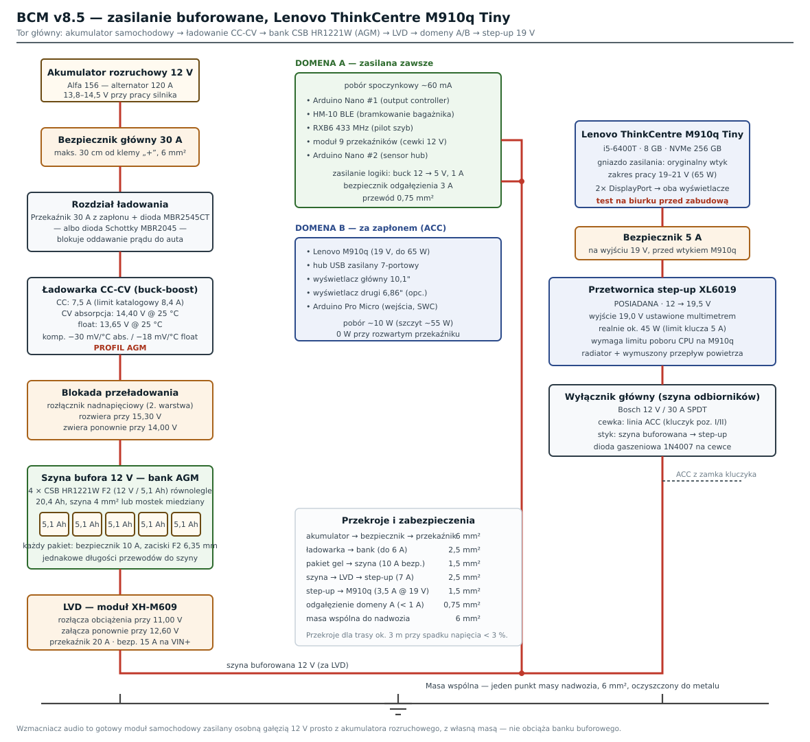

# Wdrożenie BCM v8.5 na Lenovo ThinkCentre M910q

Skonsolidowana instrukcja wdrożeniowa head unitu do Alfa Romeo 156 1.9 JTD 8V
na **platformie produkcyjnej x86 — Lenovo ThinkCentre M910q Tiny**.

Dokument opisuje **faktyczny stan repozytorium** — każda komenda, ścieżka
i nazwa pliku odnosi się do tego, co jest w drzewie. Miejsca, w których
dokumentacja źródłowa jest niespójna albo kod odbiega od opisu, są
oznaczone jako ⚠.

**Zasilanie buforowane** (bufor żelowy, ładowanie, blokada przeładowania,
step-up 19 V) ma osobny dokument: **[`ZASILANIE_BUFOROWANE.md`](ZASILANIE_BUFOROWANE.md)**.

---

## Spis treści

1. [Zakres i warunki wstępne](#1-zakres-i-warunki-wstępne)
2. [Sprzęt](#2-sprzęt)
3. [Zasilanie — streszczenie](#3-zasilanie--streszczenie)
4. [BIOS](#4-bios)
5. [System operacyjny](#5-system-operacyjny)
6. [Instalacja BCM](#6-instalacja-bcm)
7. [Usługi systemd](#7-usługi-systemd)
8. [Boot, splash, kiosk](#8-boot-splash-kiosk)
9. [Suspend i wybudzanie](#9-suspend-i-wybudzanie)
10. [Wyświetlacze i dotyk](#10-wyświetlacze-i-dotyk)
11. [Arduino — trzy płytki](#11-arduino--trzy-płytki)
12. [K-Line / OBD](#12-k-line--obd)
13. [WiFi i Android Auto](#13-wifi-i-android-auto)
14. [Audio](#14-audio)
15. [Konfiguracja modułów](#15-konfiguracja-modułów)
16. [Odbiór techniczny](#16-odbiór-techniczny)
17. [Diagnostyka](#17-diagnostyka)
18. [Reset i ponowna instalacja](#18-reset-i-ponowna-instalacja)
19. [Znane rozbieżności](#19-znane-rozbieżności)

---

## 1. Zakres i warunki wstępne

### Co ten dokument obejmuje

Pełną ścieżkę od pustego M910q do działającego head unitu w aucie:
sprzęt → zasilanie → BIOS → OS → BCM → usługi → kiosk → peryferia → odbiór.

### Czego nie obejmuje

| Temat | Gdzie szukać |
|-------|--------------|
| Symulacja na laptopie (bez sprzętu) | [`URUCHOMIENIE.md`](URUCHOMIENIE.md) § 1 |
| Szczegóły zasilania buforowanego | [`ZASILANIE_BUFOROWANE.md`](ZASILANIE_BUFOROWANE.md) |
| Okablowanie Arduino pin-po-pinie | [`ARDUINO_SETUP_GUIDE.md`](ARDUINO_SETUP_GUIDE.md) |
| Podsłuch K-Line, poznawanie PID-ów | [`KLINE_SNIFFING.md`](KLINE_SNIFFING.md) |
| Wersja ilustrowana (12 rozdziałów HTML) | [`x86-production/index.html`](x86-production/index.html) |
| Referencja krok-po-kroku (EN) | [`X86_PLATFORM_SETUP.md`](X86_PLATFORM_SETUP.md) |
| Platformy Orange Pi / VM | [`../Archive/README.md`](../Archive/README.md) |

### Warunki wstępne

- M910q sprawny, z dyskiem NVMe i pamięcią
- Pendrive ≥ 2 GB na obraz instalacyjny Debiana
- Klawiatura i monitor na czas instalacji (potem niepotrzebne)
- Dostęp do sieci (pobieranie pakietów)
- Podstawowe narzędzia elektryczne: multimetr, zaciskarka, lutownica

### Kolejność prac

Zalecana kolejność to **najpierw komplet software'u na biurku**, dopiero
potem zabudowa w aucie. Diagnostyka układu, który leży na stole, jest
nieporównanie łatwiejsza niż tego samego układu wciśniętego za deskę
rozdzielczą.

```
1. Sprzęt + BIOS + OS + BCM na biurku              (§2, §4–§7)
2. Wyświetlacze, dotyk, kiosk, splash              (§8, §10)
3. Arduino + K-Line + audio na stole               (§11, §12, §14)
4. Testy zasilania buforowanego na stole           (ZASILANIE_BUFOROWANE.md §11)
5. Zabudowa w aucie                                (ZASILANIE_BUFOROWANE.md §11 etap 3+)
6. Odbiór techniczny                               (§16)
```

---

## 2. Sprzęt

### 2.1 Lenovo ThinkCentre M910q Tiny

| Element | Specyfikacja |
|---------|--------------|
| CPU | Intel i5-6400T (4C/4T, 2,2–2,8 GHz, Skylake) |
| GPU | Intel HD 530 — sprzętowe dekodowanie VAAPI |
| RAM | 8 GB DDR4 2400 |
| Dysk | 256 GB NVMe SSD |
| WiFi/BT | **MediaTek MT7921** (M.2 Key E) — wymiana za fabryczny Intel 8265 |
| Wyjścia obrazu | **2× DisplayPort** |
| USB | 6× USB 3.0 + 1× USB-C |
| Zasilanie | 65 W, 20 V, gniazdo firmowe Lenovo |
| Obudowa | 1 litr — mieści się za deską rozdzielczą |

**Wymiana karty WiFi jest obowiązkowa.** Fabryczny Intel 8265 nie daje
stabilnego P2P-GO na 5 GHz i cierpi na resety tx-timeout przy Bluetooth.
MT7921 (PCIe `[14c3:7961]` + BT po USB `[0489:e0cd]`) obsługuje P2P-GO na
kanale 149, 80 MHz VHT, 30 dBm oraz A2DP i HFP bez problemów. Wymaga pakietu
`firmware-mediatek` z sekcji non-free-firmware.

**Orientacja montażu:** poziomo, logo do góry. Pionowo działa, ale nieco
gorzej chłodzi. M910q ma otwory VESA 100 na spodzie — najprościej zrobić
wspornik. Wszystkie kable spinaj opaskami, bo na dziurach będzie grzechotać.

### 2.2 Lista sprzętu — etap 1 (rdzeń)

| # | Element | Model / spec | Szt. | Cena (PLN) |
|---|---------|--------------|------|-----------|
| 1 | Mini-PC | Lenovo M910q Tiny (i5-6400T, 8 GB, 256 GB) — używany | 1 | 200–400 |
| 2 | Karta WiFi + BT | Fenvi FU-AX1800 (MT7921, WiFi 6 + BT 5.2) | 1 | 120–180 |
| 3 | Przetwornica step-up | 12 V → 19/20 V, ≥ 80 W — patrz `ZASILANIE_BUFOROWANE.md` §3 | 1 | 15–70 |
| 4 | Wyświetlacz główny | 7" IPS 1024×600 HDMI + dotyk USB (QDtech MPI5001) | 1 | 200–350 |
| 5 | Wyświetlacz mały | 4,3" TFT 800×480 HDMI, bez dotyku | 1 | 150–250 |
| 6 | Przejściówki DP → HDMI | pasywne, kablowe | 2 | 20–30 |
| 7 | DAC USB | ES9038Q2M, wyjście RCA | 1 | 45–75 |
| 8 | Wzmacniacz | TDA7388 (4 × 45 W klasa AB) | 1 | 45–70 |
| 9 | Radiator | aluminiowy do TDA7388 | 1 | 10–15 |
| 10 | Interfejs K-Line | CP2102 (USB-UART) + L9637D + rezystor 510 Ω | 1 | 25–40 |
| 11 | Hub USB | 7-portowy USB 3.0 **z własnym zasilaniem** | 1 | 40–60 |
| 12 | Kable | 2× DP-HDMI, USB-A, zasilanie, RCA | — | 50–80 |

Etapy 2–4 (kamery, czujniki, wejścia, subwoofer, czujnik deszczu) są
w [`x86-production/01-bom.html`](x86-production/01-bom.html).

**Zasilanie buforowane ma osobną listę zakupową** —
[`ZASILANIE_BUFOROWANE.md`](ZASILANIE_BUFOROWANE.md) §10.

### 2.3 Rozmieszczenie USB

Dwa urządzenia idą **bezpośrednio w port M910q**, reszta przez hub:

```
Porty USB M910q
  ├── Hub USB (zasilany, 7 portów)
  │     ├── Arduino Pro Micro   (wejścia: SWC, przyciski, enkoder)
  │     ├── Arduino Nano #1     (wyjścia: przekaźniki, PWM podświetlenia)
  │     ├── Arduino Nano #2     (sensor hub: drzwi, zapłon, deszcz, DS18B20)
  │     ├── CP2102              (K-Line / OBD)
  │     ├── GPS NEO-M8N
  │     ├── Modem LTE Huawei E3372
  │     └── Mikrofon USB
  ├── DAC USB (ES9038Q2M)       ← bezpośrednio, nie przez hub
  └── Graber AHD 4-kanałowy     ← bezpośrednio, nie przez hub
```

**Dlaczego bezpośrednio:** DAC to urządzenie USB Audio Class 2 — hub dokłada
opóźnienie i rywalizację o pasmo. Graber przesyła cztery strumienie 720p
jednocześnie; na hubie zaczyna gubić klatki.

---

## 3. Zasilanie — streszczenie

Pełny opis: **[`ZASILANIE_BUFOROWANE.md`](ZASILANIE_BUFOROWANE.md)**.
Tutaj tylko to, co trzeba wiedzieć, żeby zrozumieć resztę wdrożenia.



Układ ma **dwie domeny zasilania**:

| | Domena A — zawsze | Domena B — za zapłonem |
|---|---|---|
| Odbiorniki | oba Nano, HM-10 BLE, RXB6 433 MHz, przekaźniki | M910q, hub USB, wyświetlacze, Pro Micro |
| Pobór spoczynkowy | ~60 mA | 0 mA (przekaźnik rozwarty) |
| Na postoju | działa — pilot szyb, bagażnik przez BLE | odcięta |

Między akumulatorem auta a head unitem stoi **bank 5 × 12 V / 5 Ah żelowy**
(25 Ah), ładowany przez ładowarkę CC-CV z profilem GEL, chroniony
rozłącznikiem nadnapięciowym (14,6 V) i LVD (11,0 V). M910q zasila
**przetwornica step-up 12 → 19,5 V** za przekaźnikiem zapłonu.

**Konsekwencje dla software'u:**

- BCM **nie startuje z bootu** — startuje go `bcm-ignition-watcher`
  w reakcji na sygnał zapłonu z Arduino (§7),
- BIOS musi mieć **After Power Loss = Power On** (§4), inaczej maszyna nie
  wstanie po zaniku zasilania,
- przycisk zasilania jest przechwycony przez `acpid` i wykonuje czysty
  suspend do S3 (§9), a nie shutdown.

---

## 4. BIOS

Wejście: **F1** przy starcie.

| Ustawienie | Ścieżka | Wartość | Po co |
|-----------|---------|---------|-------|
| **After Power Loss** | Power | **Power On** | maszyna wstaje sama po zaniku zasilania (zapad przy rozruchu, powrót po LVD) |
| **Fast Boot** | Startup | Enabled | skraca POST |
| **Secure Boot** | Security | Disabled | wymagane przez kernel i sterowniki |
| **USB Legacy** | USB Setup | Disabled | skraca POST |
| **Wake on USB** | Power | Enabled | Arduino może wybudzić maszynę z S3 |

> ⚠ **After Power Loss = Power On to ustawienie krytyczne.** Przy „Last
> State" albo „Power Off" M910q nie wstanie po chwilowym zaniku napięcia
> na przetwornicy — a to zdarzy się przy pierwszym mocniejszym zapadzie.

Sprawdź też, czy BIOS ma włączone **S3 (nie Modern Standby / S0ix)** —
weryfikacja w §9.

---

## 5. System operacyjny

### 5.1 Instalacja Debiana 13 (Trixie)

Obraz **netinst amd64**, wgrany na pendrive.

Podczas instalacji:

- instalacja **minimalna** — tylko `SSH server` i `standard system utilities`,
- **bez** środowiska graficznego (X i kiosk instalujemy sami),
- włączone repozytorium **non-free-firmware** (potrzebne dla MT7921).

### 5.2 Po instalacji

```bash
# sudo dla użytkownika
su -
apt install -y sudo
usermod -aG sudo abner
exit
# wyloguj się i zaloguj ponownie

# non-free-firmware (Trixie może mieć już włączone)
sudo sed -i 's/main$/main non-free-firmware/' /etc/apt/sources.list
sudo apt update
```

### 5.3 Pakiety systemowe

```bash
sudo apt update && sudo apt upgrade -y

# rdzeń
sudo apt install -y \
    python3 python3-venv python3-full python3-dev python3-serial \
    git curl wget

# X + kiosk (w Debianie 13 pakiet nazywa się "chromium")
sudo apt install -y \
    xserver-xorg xinit x11-xserver-utils \
    unclutter chromium

# GPU Intel — sprzętowe dekodowanie wideo
sudo apt install -y intel-media-va-driver vainfo libva-drm2

# audio
sudo apt install -y pipewire pipewire-pulse wireplumber alsa-utils mpv

# WiFi + Bluetooth MediaTek MT7921
sudo apt install -y \
    firmware-mediatek bluez bluez-tools network-manager hostapd dnsmasq

# wideo / kamery
sudo apt install -y ffmpeg v4l-utils

# zarządzanie zasilaniem
sudo apt install -y acpid

# zram zamiast swapa na NVMe
sudo apt install -y zram-tools
echo -e 'ALGO=lz4\nPERCENT=50' | sudo tee /etc/default/zramswap
sudo systemctl enable zramswap

sudo reboot
```

Po restarcie weryfikacja sprzętowego dekodowania:

```bash
vainfo    # musi wypisać wpisy VAProfileH264
```

---

## 6. Instalacja BCM

### 6.1 Klon i środowisko

```bash
cd /opt
sudo git clone https://github.com/geek95dg/Alfa156-headunit.git bcm
sudo chown -R $USER:$USER /opt/bcm
cd /opt/bcm

# Debian 13 egzekwuje PEP 668 — venv jest obowiązkowy
python3 -m venv .venv
source .venv/bin/activate
pip install -r requirements.txt
pip install -r requirements-x86.txt
```

### 6.2 Uprawnienia

```bash
sudo usermod -aG dialout $USER    # porty szeregowe Arduino
# wyloguj się i zaloguj ponownie
```

### 6.3 Rozdzielczość wyświetlacza

W `config/bcm_config.yaml`:

```yaml
display:
  dashboard:
    width: 1024       # 7"; dla 10" → 1280
    height: 600       # 7"; dla 10" → 800
```

### 6.4 Test ręczny

```bash
source /opt/bcm/.venv/bin/activate
cd /opt/bcm
python3 main.py --platform x86 --config config/bcm_config.yaml --frontend
```

Otwórz `http://localhost:5002` — musi pojawić się dashboard. To jest brama:
jeśli tu nie działa, nie ma sensu iść dalej.

### 6.5 Skrót — skrypt all-in-one

Zamiast §7–§13 można uruchomić skrypt, który robi to wszystko naraz:

```bash
cd /opt/bcm
sudo bash config/scripts/setup-x86.sh
```

Skrypt jest **idempotentny** — można go puszczać wielokrotnie.

> ⚠ **Najpierw zedytuj sekcję USER CONFIG na górze skryptu**
> (`config/scripts/setup-x86.sh`, linie 15–45). Domyślne wartości to
> `MAIN_OUTPUT="HDMI-1"` i `SMALL_OUTPUT="HDMI-2"`, a **M910q ma dwa
> wyjścia DisplayPort** — u Ciebie złącza najprawdopodobniej nazywają się
> `DP-1` i `DP-2`. Sprawdź faktyczne nazwy:
>
> ```bash
> for f in /sys/class/drm/card*-*/status; do echo "$f: $(cat $f)"; done
> ```
>
> Do sprawdzenia i ewentualnej zmiany są też: `BCM_USER`, `TOUCH_DEVICE`,
> `MAIN_W`/`MAIN_H`, `WIFI_IFACE`, `WIFI_SSID`, `WIFI_PASS`.

Jeżeli używasz skryptu, przejdź od razu do §16 (odbiór techniczny).
Poniższe sekcje opisują to, co skrypt robi — przydają się przy diagnostyce.

---

## 7. Usługi systemd

### 7.1 Instalacja

```bash
cd /opt/bcm

sudo cp config/systemd/bcm-headunit-x86.service /etc/systemd/system/bcm-headunit.service
sudo cp config/systemd/bcm-ignition-watcher.service /etc/systemd/system/
sudo cp config/systemd/bcm-splash-main.service      /etc/systemd/system/
sudo cp config/systemd/bcm-splash-small.service     /etc/systemd/system/
sudo cp config/systemd/bcm-resume.service           /etc/systemd/system/

sudo systemctl mask bcm-kiosk.service    # kiosk startuje z xinitrc, nie z systemd
sudo systemctl daemon-reload
sudo systemctl enable bcm-ignition-watcher bcm-splash-main bcm-splash-small bcm-resume
```

> **Zwróć uwagę na pierwszą linię.** Plik źródłowy nazywa się
> `bcm-headunit-x86.service`, a instaluje się go **pod nazwą**
> `bcm-headunit.service`. Reszta jednostek odwołuje się do tej drugiej nazwy.

### 7.2 Cykl życia — to jest nieoczywiste

| Jednostka | `enable`? | Kto ją uruchamia |
|-----------|-----------|------------------|
| `bcm-ignition-watcher` | **tak** | systemd przy boocie |
| `bcm-splash-main` | tak | systemd przy boocie |
| `bcm-splash-small` | tak | systemd przy boocie |
| `bcm-resume` | tak | systemd po wyjściu z S3 |
| `bcm-headunit` | **NIE** | `bcm-ignition-watcher` w reakcji na zapłon |
| `bcm-kiosk` | **zamaskowana** | `~/.xinitrc` |

`bcm-headunit.service` ma `PartOf=bcm-ignition-watcher.service` — zatrzymuje
się razem z watcherem. Ma też `Restart=on-failure` (RestartSec=3, limit
4 restartów / 120 s), więc po crashu wstaje sam, ale czyste `systemctl stop`
od watchera go nie wskrzesza. Watcher ma dodatkowo cykliczny **liveness
check** — druga warstwa zabezpieczenia.

**Konsekwencja praktyczna:** jeśli BCM nie wstaje po boocie, sprawdzaj
**watcher**, nie `bcm-headunit`:

```bash
systemctl status bcm-ignition-watcher
journalctl -u bcm-ignition-watcher -n 50
```

### 7.3 Przycisk zasilania → suspend

```bash
sudo mkdir -p /etc/acpi/events
sudo tee /etc/acpi/events/power-button >/dev/null <<'EOF'
event=button/power
action=/usr/local/bin/bcm-power-toggle.sh
EOF
sudo cp /opt/bcm/config/scripts/bcm-power-toggle.sh /usr/local/bin/
sudo chmod +x /usr/local/bin/bcm-power-toggle.sh
sudo systemctl enable acpid
```

Dodatkowo `logind` musi przestać obsługiwać przycisk sam:

```bash
# /etc/systemd/logind.conf
[Login]
HandlePowerKey=ignore
```

### 7.4 Test bez restartu

```bash
sudo systemctl start bcm-ignition-watcher
sudo journalctl -fu bcm-ignition-watcher -u bcm-headunit
# oczekiwane: AUTOSTART → BCM started

curl http://localhost:5002    # musi zwrócić HTML
```

---

## 8. Boot, splash, kiosk

Cel: od wciśnięcia przycisku do dashboardu **bez ani jednej linijki
komunikatów kernela**. Czarny ekran → splash → dashboard.

### 8.1 GRUB — cichy i ukryty

```bash
sudo cp /etc/default/grub /etc/default/grub.bak
sudo tee /etc/default/grub >/dev/null <<'EOF'
GRUB_DEFAULT=0
GRUB_TIMEOUT=0
GRUB_HIDDEN_TIMEOUT=0
GRUB_HIDDEN_TIMEOUT_QUIET=true
GRUB_DISTRIBUTOR=""
GRUB_CMDLINE_LINUX_DEFAULT="quiet loglevel=0 vt.global_cursor_default=0 rd.systemd.show_status=false rd.udev.log_level=3 fsck.mode=skip console=tty2"
GRUB_CMDLINE_LINUX=""
GRUB_DISABLE_OS_PROBER=true
EOF
sudo update-grub
```

> **Nie dodawaj `splash`** do linii kernela — to włącza Plymouth, który
> gryzie się z odtwarzaniem wideo przez DRM.

```bash
sudo apt remove -y plymouth plymouth-themes 2>/dev/null
sudo update-initramfs -u
```

### 8.2 Pliki splash

```bash
mkdir -p /opt/bcm/assets/splash

# główny — dopasuj do rozdzielczości wyświetlacza
#  7":  ffmpeg -i source.mp4 -vf scale=1024:600 -c:v libx264 -crf 23 -c:a aac -y main.mp4
# 10":  ffmpeg -i source.mp4 -vf scale=1280:800 -c:v libx264 -crf 23 -c:a aac -y main.mp4
cp twoj_splash.mp4 /opt/bcm/assets/splash/main.mp4

# mały — bez dźwięku, 800×480
# ffmpeg -i source.mp4 -vf scale=800:480 -an -c:v libx264 -crf 23 -y small.mp4
cp twoj_splash_maly.mp4 /opt/bcm/assets/splash/small.mp4
```

Materiały brandingowe **nie są w repozytorium** — patrz
[`../assets/splash/README.md`](../assets/splash/README.md).

### 8.3 Test splash

```bash
sudo chvt 2
sudo pkill Xorg 2>/dev/null

for f in /sys/class/drm/card*-*/status; do echo "$f: $(cat $f)"; done

sudo mpv --fs --vo=drm --hwdec=auto /opt/bcm/assets/splash/main.mp4
sudo mpv --fs --vo=drm --drm-connector=DP-2 --no-audio --hwdec=auto \
    /opt/bcm/assets/splash/small.mp4
```

Jeśli mały wyświetlacz siedzi na innym złączu, nadpisz to w jednostce:

```bash
sudo systemctl edit bcm-splash-small.service
# [Service]
# Environment=BCM_SPLASH_DRM_SMALL=NazwaTwojegoZlacza
```

> `bcm-splash-play.sh` **wykrywa aktywne złącze automatycznie** — starsze
> wersje miały wpisane na sztywno `HDMI-A-1`, które na M910q jest
> rozłączone (panel siedzi na `HDMI-A-2`/DP). Nie wracaj do sztywnych nazw.

### 8.4 Autologin i start X

```bash
# start X bez roota
sudo dpkg-reconfigure xserver-xorg-legacy    # → Anybody

# autologin na tty1
sudo systemctl edit getty@tty1.service
# [Service]
# ExecStart=
# ExecStart=-/sbin/agetty --autologin abner --noclear %I $TERM

# start X tylko na tty1 — w ~/.bash_profile:
# if [ -z "$DISPLAY" ] && [ "$(tty)" = "/dev/tty1" ]; then exec startx; fi

cp /opt/bcm/config/scripts/xinitrc-x86-dual ~/.xinitrc
```

W `~/.xinitrc` na górze są zmienne `MAIN_OUTPUT` / `SMALL_OUTPUT` — ustaw
faktyczne nazwy złączy. Wariant jednoekranowy:
`config/scripts/xinitrc-x86-single`.

---

## 9. Suspend i wybudzanie

### 9.1 Weryfikacja S3

```bash
cat /sys/power/mem_sleep
# oczekiwane:  s2idle [deep]
```

Jeśli wynik to `[s2idle] deep` albo samo `[s2idle]`, wymuś deep sleep:

```bash
sudo nano /etc/default/grub
# do GRUB_CMDLINE_LINUX_DEFAULT dopisz:  mem_sleep_default=deep
sudo update-grub && sudo reboot
```

Jeśli po tym dalej nie ma `deep` — w BIOS-ie włączony jest Modern Standby
(S0ix). Przełącz na S3.

### 9.2 Co robi `bcm-power-toggle.sh`

1. `systemctl stop bcm-headunit` — czyste zamknięcie Flaska, kamer, audio
2. wyłączenie wszystkich źródeł wybudzania po USB
3. **odpięcie modemu Huawei E3372 od sterownika** — modem HiLink blokuje
   wejście w S3 na wielu systemach
4. wyłączenie wybudzania z XHCI i PS2K
5. `systemctl suspend`

### 9.3 Co robi `bcm-resume.service`

1. `sleep 2` — czas na re-enumerację USB
2. przepięcie root hubów USB (modem LTE wraca do życia)
3. `systemctl start bcm-headunit`

### 9.4 Test

```bash
# przycisk zasilania → maszyna wchodzi w S3
# przycisk ponownie → wybudzenie w ~3 s, nie 40 s zimnego startu
journalctl -b -u bcm-resume
```

---

## 10. Wyświetlacze i dotyk

Oba wyjścia M910q to **DisplayPort**. Wyświetlacze samochodowe mają zwykle
HDMI — potrzebne są **pasywne przejściówki DP → HDMI** (~10–15 PLN/szt.).

| Wyjście | Wyświetlacz | Rozdzielczość | Zawartość | Port |
|---------|-------------|---------------|-----------|------|
| DP-1 | 7"/10" IPS dotykowy | 1024×600 lub 1280×800 | dashboard BCM (A1–A8 + Settings) | 5002 |
| DP-2 | 4,3" TFT | 800×480 | karuzela statystyk + kamera cofania | 5003 |

Wykrycie nazw złączy:

```bash
for f in /sys/class/drm/card*-*/status; do echo "$f: $(cat $f)"; done
```

Dotyk musi być przypisany **tylko do ekranu głównego**, inaczej kursor
będzie chodził po obu. W `~/.xinitrc`:

```bash
xinput map-to-output "QDtech MPI5001" DP-1
```

Nazwę urządzenia dotykowego sprawdzisz przez `xinput list`.

---

## 11. Arduino — trzy płytki

Na M910q **nie ma GPIO** — całe I/O pojazdu idzie przez Arduino po USB.
Komunikat o braku `gpiod` przy starcie jest normalny i można go zignorować.

| Sketch | Płytka | Domena | Rola |
|--------|--------|--------|------|
| `arduino/rotary_encoder` | **Pro Micro** (ATmega32U4, USB HID) | B | Enkoder, przyciski, SWC, panel muzyczny, jasność |
| `arduino/output_controller` | **Nano #1** | **A** | Pilot szyb 433 MHz, bagażnik bramkowany BLE (HM-10), PWM podświetlenia |
| `arduino/sensor_hub` | **Nano #2** | A | Drzwi, maska, klapa, ręczny, zapłon, deszcz, DS18B20 |

### 11.1 Kompilacja i wgrywanie

```bash
# jednorazowo
curl -fsSL https://raw.githubusercontent.com/arduino/arduino-cli/master/install.sh | sh
arduino-cli core update-index && arduino-cli core install arduino:avr

# kompilacja wszystkich trzech
make -C arduino

# wgrywanie — podaj właściwy port
make -C arduino rotary_encoder-upload    PORT=/dev/ttyACM0   # Pro Micro
make -C arduino output_controller-upload PORT=/dev/ttyUSB0   # Nano #1
make -C arduino sensor_hub-upload        PORT=/dev/ttyUSB1   # Nano #2
```

Profile w `sketch.yaml` przypinają wersje core'a i bibliotek, więc
`arduino-cli` pobiera dokładnie to, czego potrzeba.

### 11.2 Przełączniki funkcji w `sensor_hub`

Na górze `sensor_hub.ino` każda grupa wejść ma `#define FEATURE_*`:

- domyślnie włączone: `FEATURE_DOORS`, `FEATURE_HBRAKE`, `FEATURE_IGN`,
  `FEATURE_RAIN`, `FEATURE_TEMP`
- domyślnie wyłączone: `FEATURE_PARK`, `FEATURE_CRUISE`, `FEATURE_IMMO`,
  `FEATURE_AIRBAG`

Zakomentowanie `#define` usuwa funkcję z firmware i zwalnia pin. Po zmianie
wgraj sketch ponownie.

### 11.3 Uwaga do wersji 8.5.2

Przycisk enkodera przeniesiony z **D4 na D1** — na Pro Micro D4 i A6 to ten
sam fizyczny pin i kolidowało z SWC Pod 2. Przy starszym okablowaniu przepnij
jeden przewód. Wszystkie trzy sketche mają teraz 2-sekundowy watchdog
sprzętowy.

### 11.4 Szybki test

```bash
picocom -b 115200 /dev/ttyUSB1
# oczekiwane linie: DOOR:..., IGN:0, TEMP:21.4
```

Okablowanie pin-po-pinie: [`ARDUINO_SETUP_GUIDE.md`](ARDUINO_SETUP_GUIDE.md)
§7 (Nano always-on) i §7b (sensor hub).

---

## 12. K-Line / OBD

Tor na M910q: **USB → CP2102 (USB-UART) → L9637D (transceiver) → pin 7
złącza OBD-II**. Rezystor podciągający 510 Ω z linii K do 12 V.

Domyślnie x86 pracuje na **symulatorze ECU** — wygodne przy testach na stole.
Żeby czytać z prawdziwego auta, w `config/bcm_config.yaml`:

```yaml
obd:
  use_real_hardware: true
  fast_init: false
serial:
  kline:
    port_x86: /dev/ttyUSB_kline    # CP2102 + reguła udev
```

Reguła udev jest konieczna — bez niej numeracja `/dev/ttyUSBn` przeskakuje
między restartami i K-Line trafia na port Arduino.

Poznawanie PID-ów (obroty, temperatury) i pełna procedura podsłuchu:
[`KLINE_SNIFFING.md`](KLINE_SNIFFING.md) + `tools/kline_sniffer.py`.

ECU w Alfa 156 1.9 JTD 8V: **Bosch EDC15C7**, protokół KWP2000
(`src/obd/edc15c7.py`, `src/obd/kwp2000.py`).

---

## 13. WiFi i Android Auto

### 13.1 Dwie niezależne funkcje WiFi

| Moduł | Do czego | Domyślnie |
|-------|----------|-----------|
| `wifi_ap` | **tylko** Android Auto wireless (Wi-Fi Direct / P2P-GO na karcie wewnętrznej) | włączony |
| `wifi_hotspot` | dodatkowy AP **ALFA-NET** do współdzielenia internetu z LTE | wyłączony |

Karta wewnętrzna **nie zrobi P2P-GO i AP jednocześnie** — MT7921 zgłasza
`#{AP, P2P-GO} <= 1`. `wifi_hotspot` wymaga więc **osobnego dongla USB WiFi**
(RTL8812BU). Włączaj go dopiero po podpięciu dongla.

### 13.2 Test P2P-GO

```bash
# sprawdź, że załadował się właściwy sterownik
lspci -k | grep -A3 -i network      # oczekiwane: mt7921e
iw list | grep -A10 "valid interface combinations"
```

Domyślny tryb to `wpa_supplicant` P2P-GO sterowany z `src/multimedia/wifi_ap.py`
— systemowy `hostapd` zostaje wyłączony, żeby proces Pythona miał radio na
wyłączność. Fallback na `hostapd` jest utrzymany dla starszych wdrożeń
(`wifi.mode: hostapd` w YAML).

### 13.3 Android Auto

`openauto` kompiluje się ze źródeł — procedura (aasdk, h264bitstream,
openauto, łatki na OpenSSL 3.0 i librtaudio 6.x) jest w
[`X86_PLATFORM_SETUP.md`](X86_PLATFORM_SETUP.md) §11 oraz
[`x86-production/11-android-auto.html`](x86-production/11-android-auto.html).

Weryfikacja po kompilacji:

```bash
ls -la /usr/local/bin/autoapp     # ~5 MB
sudo systemctl restart bcm-headunit
journalctl -u bcm-headunit | grep -i openauto
# oczekiwane: "OpenAuto found: /usr/local/bin/autoapp"
```

---

## 14. Audio

Tor: **ES9038Q2M (DAC USB) → RCA → TDA7388 (4 × 45 W) + TDA2050 (subwoofer)
→ układ 4.1**. Schemat: [`../schematics/audio_system.svg`](../schematics/audio_system.svg).

Software: PipeWire + WirePlumber, 10-pasmowy EQ, analizator widma, ducking
(`src/audio/`). Profil EQ: `config/pipewire/eq-profile.json`.

Bluetooth: profil HFP przez oFono (`config/systemd/ofono.service.d/`,
`config/wireplumber/wireplumber.conf.d/51-bcm-hfp-ofono.conf`), z wymuszeniem
BR/EDR (`config/scripts/bt-prefer-bredr.sh`) — BLE-only powodowało problemy
z parowaniem telefonów.

> **Zasilanie wzmacniaczy idzie osobną gałęzią** prosto z akumulatora
> rozruchowego (bezpiecznik 20 A), **nie z banku buforowego** — patrz
> [`ZASILANIE_BUFOROWANE.md`](ZASILANIE_BUFOROWANE.md) §2. TDA7388 klasy AB
> ciągnie 6–8 A przy średniej głośności, do 20 A w szczytach.

Masę wzmacniaczy prowadź osobno, blisko wzmacniaczy — wspólna masa
z komputerem daje pętlę i przydźwięk alternatora.

---

## 15. Konfiguracja modułów

Jedno źródło prawdy: `src/core/modules_catalog.py`. Każdy moduł włącza się
na dwa sposoby:

- **UI:** Settings → Moduły (endpoint `/api/modules`)
- **YAML:** `modules.<nazwa>` w `config/bcm_config.yaml`

**Zmiany wymagają restartu BCM.** Pełna tabela 28 przełączników jest
w [`URUCHOMIENIE.md`](URUCHOMIENIE.md) §5.

Honorowane są też starsze klucze (`bluetooth.enabled`, `wifi.enabled`,
`fuel_sender.enabled`, blok `modules_v85.*`), ale `modules.<nazwa>` ma
zawsze pierwszeństwo.

### Moduły wymagające dodatkowej konfiguracji

| Moduł | Co trzeba |
|-------|-----------|
| `obd` | `use_real_hardware: true` + reguła udev (§12) |
| `wifi_hotspot` | osobny dongiel USB WiFi (§13.1) |
| `weather` | klucz API OpenWeatherMap |
| `route_planner` | klucze OpenRouteService / TomTom |
| `network` | `config/lte.conf` na bazie `config/lte.conf.example` |
| `battery` | ⚠ patrz §19.3 — nie działa bez dorobienia dzielnika i progów |

---

## 16. Odbiór techniczny

Checklista końcowa. Wszystko musi przejść przed uznaniem wdrożenia
za zakończone.

### 16.1 Software

```
[ ] curl http://localhost:5002 zwraca HTML
[ ] Wyświetlacz główny (DP-1) pokazuje dashboard BCM
[ ] Wyświetlacz mały (DP-2) pokazuje ekran statystyk
[ ] Ekrany są niezależne, nie rozciągnięte jako jeden pulpit
[ ] Dotyk działa i tylko na ekranie głównym
[ ] Splash odtwarza się na obu ekranach przy zimnym starcie
[ ] Splash znika w momencie pojawienia się dashboardu
[ ] Podczas bootu nie ma ANI JEDNEJ linii komunikatów kernela
[ ] Przycisk zasilania → S3; ponowne wciśnięcie → wybudzenie w ~3 s
[ ] Audio wychodzi przez DAC USB na głośniki
[ ] Telefon widzi sieć ALFA_AA i dostaje adres IP
[ ] Android Auto łączy się (jeśli openauto skompilowany)
```

### 16.2 Peryferia

```
[ ] Wszystkie trzy Arduino widoczne jako osobne /dev/tty*
[ ] picocom na sensor hubie pokazuje DOOR / IGN / TEMP
[ ] SWC z kierownicy steruje głośnością i utworami
[ ] Enkoder i przyciski panelu działają
[ ] Kamera cofania włącza się na wstecznym biegu
[ ] Kierunkowskazy przełączają kamery boczne
[ ] Czujniki parkowania mierzą i buzzer reaguje
[ ] K-Line czyta obroty i temperatury z ECU (jeśli use_real_hardware)
```

### 16.3 Zasilanie i integracja z autem

```
[ ] Rozruch silnika przy działającym BCM — komputer NIE resetuje się
[ ] Wyłączenie zapłonu → domena B gaśnie, pobór 0 mA
[ ] Domena A dalej działa — pilot 433 MHz i BLE bagażnika odpowiadają
[ ] Prąd spoczynkowy domeny A ~60 mA
[ ] Prąd ładowania banku ≤ 6 A przy pracującym silniku
[ ] Napięcie banku nie przekracza 14,20 V
[ ] Po 48 h postoju auto normalnie odpala
[ ] BCM wstaje automatycznie po włączeniu zapłonu
```

Pełna procedura pomiarowa dla zasilania:
[`ZASILANIE_BUFOROWANE.md`](ZASILANIE_BUFOROWANE.md) §11.

---

## 17. Diagnostyka

### Logi

```bash
tail -f /opt/bcm/logs/bcm.log              # log aplikacji (system.log_file w YAML)
journalctl -u bcm-headunit -n 50           # usługa BCM
journalctl -u bcm-ignition-watcher -n 50   # watcher zapłonu
journalctl -b -u bcm-resume                # wyjście z S3
```

### Najczęstsze problemy

| Objaw | Przyczyna | Co zrobić |
|-------|-----------|-----------|
| BCM nie wstaje po boocie | `bcm-headunit` nie jest i **nie ma być** enable'owany | sprawdź `bcm-ignition-watcher` — to on startuje BCM |
| `Address already in use` na 5002 | działa druga instancja | `ss -tlnp \| grep 5002`, potem `pkill -f main.py` lub `systemctl stop bcm-headunit` |
| Splash nie startuje | zła nazwa złącza DRM albo X trzyma framebuffer | `systemctl edit bcm-splash-small.service` → `BCM_SPLASH_DRM_SMALL=`; przy teście ręcznym najpierw ubij X |
| Widoczny tylko jeden ekran | przejściówka DP-HDMI albo kabel | sprawdź `/sys/class/drm/card*-*/status` — muszą być dwa `connected` |
| Ekrany połączone w jeden pulpit | brak `xrandr --pos` | popraw `~/.xinitrc` |
| Dotyk chodzi po obu ekranach | brak `map-to-output` | `xinput map-to-output "<nazwa>" DP-1` |
| Brak `gpiod` przy starcie | **normalne na x86** | zignoruj — I/O idzie przez Arduino |
| Błędy BlueZ na maszynie deweloperskiej | brak sprzętu BT | `modules.bluetooth: false` + `modules.phonebook: false` |
| WiFi „hardware init failed" | brak `firmware-mediatek` | `sudo apt install firmware-mediatek` i restart |
| Nie wchodzi w S3 | modem LTE HiLink blokuje suspend | `bcm-power-toggle.sh` odpina go — sprawdź, czy skrypt jest w `/usr/local/bin` i wykonywalny |
| `mem_sleep` bez `deep` | Modern Standby w BIOS | włącz S3 w BIOS, ewentualnie `mem_sleep_default=deep` |
| Zepsuty venv (`pip: command not found`) | — | `rm -rf .venv && python3 -m venv .venv` + reinstalacja requirements |
| Nowe klasy Tailwind bez stylów | CSS jest prekompilowany | `./config/scripts/build-frontend.sh` |

### Frontend — prekompilowany Tailwind

Frontend **nie** używa runtime'owego `tailwind.js`. Statyczny, zminifikowany
arkusz `src/dashboard/web/assets/vendor/tailwind.css` (~37 KB) jest generowany
z góry i commitowany. Po dodaniu nowych klas w `index.html` albo w `js/**`
trzeba przebudować:

```bash
./config/scripts/build-frontend.sh    # wymaga node/npm
```

---

## 18. Reset i ponowna instalacja

Przy nawarstwionych konfiguracjach z wielu prób najprościej wyczyścić
wszystko i zainstalować od nowa:

```bash
cd /opt/bcm && git pull
sudo bash config/scripts/setup-x86.sh      # czyści i instaluje
```

Samo czyszczenie, bez instalacji:

```bash
sudo bash config/scripts/cleanup-x86.sh
```

Usuwane są: wszystkie usługi BCM, `~/.xinitrc`, `~/.bash_profile`, override
autologinu, konfiguracje hostapd / dnsmasq / NetworkManager, override acpid
dla przycisku zasilania, polityka Chromium, konfiguracja X11 wrapper oraz
venv.

Jest jeszcze `config/scripts/apply-fixes.sh` — nakłada poprawki na istniejącą
instalację bez pełnego resetu.

---

## 19. Znane rozbieżności

Rzeczy wykryte przy porządkowaniu dokumentacji. Żadna nie blokuje wdrożenia,
ale wszystkie potrafią kosztować godzinę szukania.

### 19.1 `setup-x86.sh` domyślnie zakłada HDMI, nie DisplayPort

`config/scripts/setup-x86.sh` ma w USER CONFIG `MAIN_OUTPUT="HDMI-1"` /
`SMALL_OUTPUT="HDMI-2"`, podczas gdy M910q ma **dwa wyjścia DisplayPort**
i złącza zwykle nazywają się `DP-1` / `DP-2`. **Zawsze sprawdź faktyczne
nazwy przed uruchomieniem skryptu** (§6.5).

### 19.2 Nastawy ładowania pod AGM, nie pod żel

`X86_PLATFORM_SETUP.md` § 2.2 i `x86-production/10-power-suspend.html` podają
14,4 V absorpcji / 13,8 V float i limit prądu 15–20 A — to wartości **dla
AGM**. Dla akumulatorów **żelowych** są za wysokie i skracają żywotność banku.
Obowiązujące nastawy: [`ZASILANIE_BUFOROWANE.md`](ZASILANIE_BUFOROWANE.md) §4.3 i §5.

Tam też jest wyjaśnione, dlaczego proponowany moduł **buck** XL4016 nie może
pełnić roli ładowarki (nie podniesie napięcia do absorpcji) — §5.1.

### 19.3 Moduł `battery` nie monitoruje banku buforowego

`src/power/battery.py` ma progi **ogniwa Li-ion 18650** (4,2 / 3,7 / 3,3 /
3,0 V) i nasłuchuje zdarzenia `arduino.battery_voltage`, którego **żaden
z trzech sketchy Arduino nie publikuje**. `modules.battery: true` włącza więc
kod, który nigdy nic nie policzy.

Co trzeba dorobić (dzielnik napięcia, publikacja z sensor huba, progi dla
banku 12 V): [`ZASILANIE_BUFOROWANE.md`](ZASILANIE_BUFOROWANE.md) §13.4.

### 19.4 Czas postoju „17 dni"

Liczba w `X86_PLATFORM_SETUP.md` § 2.3 pochodzi z pełnego rozładowania banku,
mimo adnotacji o ograniczeniu do 50 % DoD. Poprawione wartości:
[`ZASILANIE_BUFOROWANE.md`](ZASILANIE_BUFOROWANE.md) §9.2.

### 19.5 Nazewnictwo jednostki `bcm-headunit.service`

Plik `config/systemd/bcm-headunit.service` był **wariantem Orange Pi PC**,
mimo neutralnej nazwy. Został zarchiwizowany jako
`Archive/orange-pi-pc/bcm-headunit-opi-pc.service`. Na M910q instaluje się
`bcm-headunit-x86.service` **pod nazwą** `bcm-headunit.service` (§7.1).

---

## Powiązane dokumenty

| Dokument | Zakres |
|----------|--------|
| [`ZASILANIE_BUFOROWANE.md`](ZASILANIE_BUFOROWANE.md) | zasilanie buforowane: schematy, dobór, lista zakupowa, procedura rozruchu |
| [`URUCHOMIENIE.md`](URUCHOMIENIE.md) | symulacja na laptopie, przełączniki modułów, Arduino w skrócie |
| [`X86_PLATFORM_SETUP.md`](X86_PLATFORM_SETUP.md) | referencja krok-po-kroku (EN) — pamiętaj o §19 |
| [`x86-production/index.html`](x86-production/index.html) | 12 rozdziałów z ilustracjami |
| [`ARDUINO_SETUP_GUIDE.md`](ARDUINO_SETUP_GUIDE.md) | okablowanie trzech płytek Arduino |
| [`KLINE_SNIFFING.md`](KLINE_SNIFFING.md) | podsłuch K-Line, poznawanie PID-ów ECU |
| [`../schematics/README.md`](../schematics/README.md) | indeks schematów elektrycznych |
| [`PODSUMOWANIE_KONSOLIDACJI.md`](PODSUMOWANIE_KONSOLIDACJI.md) | raport z konsolidacji: co przeniesiono, jakie rozbieżności wykryto |
| [`../AUDYT_I_PLAN.md`](../AUDYT_I_PLAN.md) | audyt repozytorium i roadmapa |
| [`../Archive/README.md`](../Archive/README.md) | platformy zarchiwizowane |
