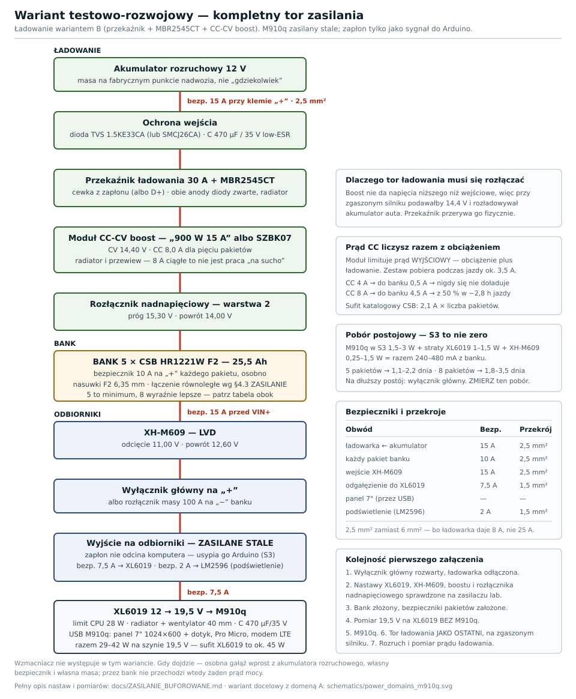
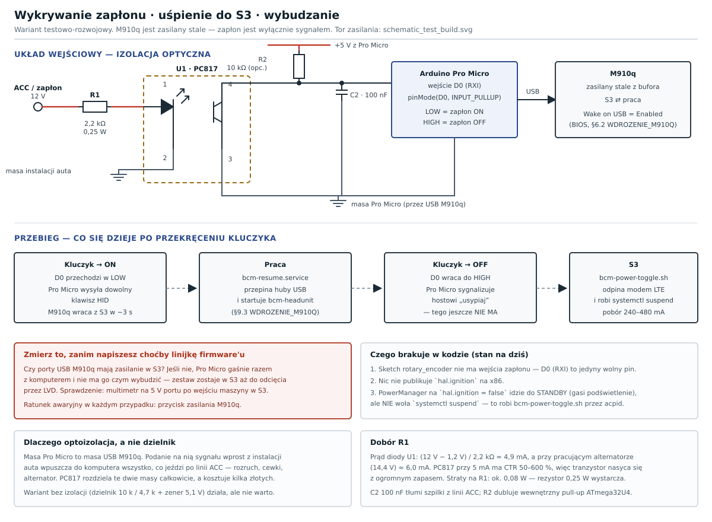

# Wdrożenie testowo-rozwojowe — mało funkcji, pełny tor zasilania

Wariant do bieżącej weryfikacji i poprawek **w jeżdżącym aucie**: Android Auto
wireless + dźwięk przez mini-jack M910q, ekran 7", przyciski SWC, modem LTE.
Wszystko pozostałe wyłączone.

Wdrożenie docelowe (pełne): [`WDROZENIE_M910Q.md`](WDROZENIE_M910Q.md).

> **To nie jest stanowisko biurkowe.** Zestaw jedzie w aucie, więc tor
> zasilania jest kompletny: ładowanie banku, blokada przeładowania i LVD.
> Oszczędzamy na funkcjach BCM i na wariancie ładowarki — **nie na
> zabezpieczeniach**.

> **Ekran 7" to konfiguracja tymczasowa.** Docelowy panel to **10,1"
> 1280×800**, opcjonalnie drugi **6,86" 1280×480** — i tak jest ustawione
> w `config/bcm_config.yaml`. Ten wariant używa osobnego pliku
> `config/bcm_config_test.yaml` z 1024×600, żeby nie ruszać konfiguracji
> produkcyjnej.

---

## Spis treści

1. [Co uruchamiamy](#1-co-uruchamiamy)
2. [Co już masz](#2-co-już-masz)
3. [Zasilanie](#3-zasilanie)
4. [Lista zakupowa](#4-lista-zakupowa)
5. [Instalacja software'u](#5-instalacja-softwareu)
6. [Uruchomienie](#6-uruchomienie)
7. [Odbiór](#7-odbiór)
8. [Czego celowo nie ma](#8-czego-celowo-nie-ma)
9. [Droga do wersji docelowej](#9-droga-do-wersji-docelowej)

---

## 1. Co uruchamiamy

Pięć modułów zamiast dwudziestu ośmiu, plus dwa podsystemy potrzebne do
Android Auto wireless:

| Przełącznik | Po co | Czego wymaga |
|-------------|-------|--------------|
| `dashboard` | frontend na porcie 5002 | ekran 7" + Chromium |
| `multimedia` | **Android Auto** (openauto) | telefon + BT + P2P-GO |
| `input` | **przyciski SWC** | Arduino Pro Micro (USB HID) |
| `audio` | głośność i EQ | wyjście analogowe M910q |
| `network` | status łącza | modem LTE (przez NetworkManager) |
| `bluetooth` | bootstrap handshake'u AA wireless | karta/dongiel BT |
| `wifi_ap` | P2P-GO — łącze danych AA | karta MT7921 |

Reszta — OBD, kamery, parkowanie, czujniki, przekaźniki, GPS, alarm — jest
**wyłączona**, bo nie ma podłączonego sprzętu. Włączanie modułów bez
hardware'u produkuje tylko szum w logach.

### Trzy ustalenia z kodu, które upraszczają ten wariant

**Dźwięk nie wymaga DAC-a USB.** `src/audio/pipewire_ctrl.py` na x86 używa
**domyślnego sinka PipeWire** — czyli tego, co ustawisz w systemie. Wyjście
analogowe M910q (mini-jack) działa bez żadnych zmian w kodzie. DAC USB
ES9038Q2M to podniesienie jakości, nie warunek uruchomienia.

**Modem LTE nie wymaga konfiguracji w BCM.** `src/network/lte.py` na x86
tylko **raportuje** stan łącza (`lte.connected`, `lte.signal`, `lte.ip`);
samo połączenie robi NetworkManager. Huawei E3372 w trybie HiLink zgłasza się
jako karta sieciowa i działa od podłączenia.

**Moduł `power` nie usypia maszyny — nawet gdy go włączysz.**
`PowerManager` (`src/power/power_manager.py`) na `hal.ignition = false`
przechodzi do STANDBY, co oznacza wygaszenie podświetlenia i
`power.active = false` — **żadnego `systemctl suspend`**. Uśpienie robi
`bcm-power-toggle.sh` przez acpid, poza BCM. Do tego na x86 nikt
`hal.ignition` nie publikuje. Pełne rozpisanie luki: §3.1a.

---

## 2. Co już masz

| Element | Uwaga |
|---------|-------|
| Lenovo M910q | |
| Ekran 7" | 1024×600, HDMI + dotyk USB |
| Karta WiFi MediaTek MT7921 | **AA wireless po P2P-GO już działa** |
| Pody SWC + dekoder | rezystorowa drabinka → wejście analogowe |
| Modem LTE Huawei E3372 | HiLink, USB |
| Akumulatory CSB HR1221W × 8 | AGM 12 V / 5,1 Ah |
| **XL6019** | step-up 12 → 19,5 V dla M910q |
| **XH-M609** | LVD, ochrona banku przed rozładowaniem |

---

## 3. Zasilanie

### 3.1 Tor — co jedzie w aucie



| Rysunek | Co pokazuje |
|---------|-------------|
| [`power_test_build.svg`](../schematics/power_test_build.svg) | przegląd blokowy — ten powyżej |
| [`schematic_test_build.svg`](../schematics/schematic_test_build.svg) | **schemat ideowy** z symbolami elektrycznymi |
| [`wiring_test_build.svg`](../schematics/wiring_test_build.svg) | **schemat połączeniowy** — zaciski i numery przewodów |
| [`ignition_sense.svg`](../schematics/ignition_sense.svg) | **wykrywanie zapłonu** — optoizolacja, wartości elementów |

Tabele „skąd → dokąd": [`SCHEMATY_POLACZEN.md`](SCHEMATY_POLACZEN.md) §10.

```
akumulator rozruchowy
   │  bezpiecznik 15 A przy klemie „+", przewód 2,5 mm²
   ▼
TVS + kondensator 470 µF/35 V        ← ochrona wejścia (§5.4 ZASILANIE)
   │
   ▼
przekaźnik ładowania 30 A            ← cewka z zapłonu, dioda 1N4007
   │
   ▼
dioda MBR2545CT (obie połówki równolegle, radiator)
   │
   ▼
moduł CC-CV boost  (CV 14,40 V, CC wg §3.3)
   │
   ▼
rozłącznik nadnapięciowy (próg 15,30 V)   ← warstwa 2
   │
   ▼
BANK AGM 4 × HR1221W ── bezpiecznik 10 A na „+" każdego pakietu
   │
   ▼
XH-M609 (LVD)  ── bezpiecznik 15 A przed VIN+
   │  odcięcie 11,00 V · powrót 12,60 V
   ▼
wyłącznik główny na „+"  (albo rozłącznik masy na „−" banku)
   │
   ├── bezp. 7,5 A → XL6019 12 → 19,5 V → M910q   ← ZASILANY STALE
   │                                     └── USB: panel 7", dotyk,
   │                                         Pro Micro, modem LTE
   │
   └── bezp. 2 A → LM2596 12 → 5 V → podświetlenie panelu (§3.1b)

sygnał zapłonu ──► wejście Arduino ──► USB ──► M910q: S3 / wybudzenie
```

Cztery rzeczy warto tu zauważyć:

- **Nie ma już domeny B.** M910q wisi na buforze na stałe, a zapłon jest
  tylko **sygnałem** — Arduino go wykrywa i usypia albo wybudza komputer.
  Konsekwencje w §3.1a; jedna z nich jest kosztowna.
- **Przekaźnik przeniósł się do toru ładowania.** Rozłącza ładowanie przy
  zgaszonym silniku — nie odcina już niczego po stronie odbiorników.
- **Panel 7" wisi na USB M910q** — dotyk i zasilanie idą tym samym kablem,
  więc USB musi zostać. Osobno idzie tylko **podświetlenie**, przez LM2596
  na złącze PWM + GND panelu (§3.1b).
- **Jeden bezpiecznik na komputer — ale większy.** Wszystko idzie przez
  XL6019, więc przy 45 W wyjścia i sprawności 85 % to 4,2 A przy 12,6 V,
  a przy napięciu banku bliskim progu LVD **4,6 A**. Bezpiecznik 5 A
  siedziałby na krawędzi i przepalał się bez żadnej usterki — dlatego
  **7,5 A**.

### 3.1a Stałe zasilanie i S3 — co to kosztuje

Zapłon nie odcina już komputera. Zamiast tego **Arduino wykrywa zmianę stanu
zapłonu**, a M910q schodzi do **S3** i z niego wraca. Zysk jest realny:
wybudzenie w ~3 s zamiast ~40 s zimnego startu, bez ryzyka ucięcia zapisu
na dysk w połowie.

Cena też jest realna — i to jest najważniejsza liczba w tej zmianie:

| Stan na postoju | Pobór z banku |
|-----------------|---------------|
| M910q w S3 (przez XL6019) | 160–320 mA |
| Arduino Nano przez MP1584 | ~15 mA |
| XH-M609 — **zmierz**, to jedyna niewiadoma | 20–125 mA |
| **Razem** | **200–460 mA** |

> **Wyświetlacz nie występuje w tej tabeli i to jest sprawdzone.** M910q
> **odcina zasilanie portów USB w S3**, więc panel gaśnie razem
> z komputerem i nie pobiera nic. Z tego samego powodu „Wake on USB" jest
> tu bezużyteczne, a Arduino **musi** mieć własne 5 V z MP1584 — inaczej
> zgaśnie razem z portem i nie będzie czym nacisnąć przycisku.

| Stan | Pobór | 4 pakiety (20,4 Ah, do 50 % DoD) |
|------|-------|----------------------------------|
| **S3** | 200–460 mA | **0,9–2,1 dnia** |
| **Wyłączony** (impuls 5 s) | 50–150 mA | **2,8–8,5 dnia** |

Dlatego eskalacja z S3 do pełnego wyłączenia po dwóch godzinach jest tu
naprawdę warta zachodu — a przy sterowaniu przyciskiem zasilania kosztuje
tyle, co dłuższy impuls.

Rozrzut w obu wierszach bierze się prawie w całości z XH-M609. Zmierz go
raz, a obie liczby zrobią się konkretne.

Co z tym zrobić:

- **Auto używane co dzień lub co drugi dzień** — to nie problem, bank i tak
  doładowuje się podczas jazdy.
- **Dłuższy postój** — użyj **wyłącznika głównego**. To jedyna rzecz, która
  naprawdę zeruje pobór, i dlatego został na liście jako obowiązkowy.
- **XH-M609 jest siatką bezpieczeństwa**, nie planem: odetnie przy 11,00 V,
  więc bank przeżyje, ale wrócisz do wyłączonego zestawu.
- **Eskalacja S3 → pełne wyłączenie** po 2 h postoju: przy sterowaniu
  przyciskiem zasilania to jedna linijka firmware'u (impuls 5 s zamiast
  250 ms), a powrót to znowu krótki impuls. Patrz niżej.

#### Jak to zrobić najmniejszym kosztem — przez fizyczny przycisk zasilania



Przycisk zasilania M910q to zwykły **przycisk chwilowy zwierny**, a Linux ma
na nim już zbudowaną całą potrzebną logikę:

| Stan maszyny | Krótkie wciśnięcie |
|--------------|--------------------|
| praca | acpid → `bcm-power-toggle.sh` → **S3** |
| S3 | **wybudzenie** w ~3 s |
| wyłączona | **start** |
| dowolny, przytrzymanie > 4 s | twarde wyłączenie |

Czyli **jeden impuls obsługuje oba kierunki**. Wystarczy, żeby Arduino umiało
ten przycisk „nacisnąć" — styki **modułu przekaźnika 1-kanałowego wpięte
równolegle** do przycisku, sterowane impulsem 250 ms z pinu **A2**.

Co to daje w porównaniu z wysyłaniem klawiszy HID i osobnym hakiem na hoście:

| | |
|---|---|
| ✅ | **zero zmian po stronie hosta** — `acpid` + `bcm-power-toggle.sh` już są skonfigurowane (§7.3 [`WDROZENIE_M910Q.md`](WDROZENIE_M910Q.md), `HandlePowerKey=ignore` w `logind.conf`) |
| ✅ | wybudzanie **nie zależy od „Wake on USB"** — przycisk zasilania działa zawsze, także po twardym wyłączeniu |
| ✅ | eskalacja S3 → pełne wyłączenie po kilku godzinach to po prostu **dłuższy impuls** (5 s), a powrót — znowu krótki |
| ⚠️ | układ jest **otwarty**: Arduino nie wie, czy maszyna śpi. Pulsujemy na *zmianę* stanu zapłonu, więc rozjazd wymaga zdarzenia z zewnątrz i naprawia się przy następnym cyklu kluczyka |

Domknięcie pętli, jeśli kiedyś zacznie przeszkadzać: wejście z **diody
zasilania panelu przedniego** (świeci = praca, miga = S3). Jeden przewód
więcej, za to stan czytany zamiast zakładanego.

**Zostaje jedna rzecz do dorobienia — firmware Pro Micro:**

| Element | Szczegóły |
|---------|-----------|
| Wejście zapłonu na **D0 (RXI)** | jedyny fizycznie wolny pin. Sygnał 12 V **musi** iść przez optoizolator PC817 — nie wprost na pin 5 V |
| Wyjście na przekaźnik na **A2** | pin jest zajęty przez przycisk dźwigni „brightness cycle”, ale ta funkcja **i tak dziś nic nie robi** (§3.1c), więc jest wolny w praktyce |
| Debounce zapłonu 2 s + impuls 250 ms / 5 s | żeby migotanie na linii ACC nie usypiało maszyny w kółko |

`modules.power` zostaje wyłączony i nie ma to znaczenia: `PowerManager`
w stanie STANDBY gasi podświetlenie, a nie usypia maszynę — uśpienie robi
acpid, poza BCM.

> **Pro Micro musi mieć własne 5 V.** Jeżeli wisi na USB M910q, a ten odcina
> zasilanie portów w S3 — Arduino gaśnie razem z komputerem i nie ma czym
> nacisnąć przycisku. Zasil je z **MP1584** z bufora i **przetnij żyłę VBUS
> w kablu USB** (albo użyj kabla data-only): dwa źródła 5 V zwarte razem to
> proszenie się o kłopoty. Dane po USB zostają.

> **Zanim cokolwiek zlutujesz — zmierz przycisk.** Miernik w tryb ciągłości,
> maszyna odłączona od zasilania: zaciski mają być rozwarte, a przy wciśnięciu
> zwarte. To potwierdza, że to zwykły przycisk chwilowy, i pokazuje, gdzie
> wpiąć styki przekaźnika.

### 3.1b Podświetlenie panelu — osobne zasilanie

Panel ma osobne złącze **PWM + GND** do sterowania podświetleniem, niezależne
od USB. To pozwala rozdzielić dwie rzeczy:

| Co | Skąd |
|----|------|
| logika panelu + dotyk | **USB z M910q** — tu nic się nie zmienia |
| podświetlenie | **LM2596 12 → 5 V** wprost z bufora, bezp. 2 A |

Dzięki temu podświetlenie nie zjada budżetu portu USB (patrz niżej) ani
zapasu XL6019.

**Regulacji jasności w tym wariancie nie ustawiaj z BCM** — dlaczego,
opisuje §3.1c. Wejście PWM podaj na stały poziom, a jasność reguluj
**fizycznymi przyciskami panelu**.

> **Zgaś podświetlenie razem z komputerem.** LM2596 wisi na buforze na stałe,
> więc jeżeli panel świeci przy M910q w S3, dokładasz **2–4 W do poboru
> postojowego** — a to niemal podwaja liczby z §3.1a. Większość paneli gasi
> podświetlenie sama po zaniku sygnału HDMI; **sprawdź to pomiarem**. Jeżeli
> Twój tego nie robi, wstaw na wyjście LM2596 mały przekaźnik albo MOSFET
> sterowany z Arduino — ono i tak zna stan zapłonu.

#### Budżet portu USB

Po zdjęciu podświetlenia z USB zostaje sama logika panelu i dotyk, czyli
0,2–0,4 A przy 5 V. Port USB 3.0 M910q daje 900 mA, USB 2.0 — 500 mA, więc
jeden port wystarcza z zapasem. Gdyby panel jednak przyszedł z kablem
rozgałęzionym na dwa wtyki, podepnij oba do **różnych** portów — objawem
niedoboru jest migotanie albo restart panelu, nie brak obrazu.

#### Zapas XL6019

| Odbiornik | Moc |
|-----------|-----|
| M910q (limit CPU 28 W) | 25–35 W |
| Panel — logika + dotyk przez USB | 1–2 W |
| Pro Micro + modem LTE | 3–5 W |
| **Razem na szynie 19,5 V** | **29–42 W** |

XL6019 daje ok. **45 W**. Przeniesienie podświetlenia na LM2596 odzyskało
kilka watów, ale zapas dalej jest cienki, więc **limit poboru CPU nie jest
zaleceniem, tylko warunkiem działania** — instrukcja w
[`ZASILANIE_BUFOROWANE.md`](ZASILANIE_BUFOROWANE.md) §3.5a. Drugi panel na
tej samej szynie i tak się nie zmieści.

### 3.1c Regulacja jasności — czego nie ma w kodzie

Obserwacja, że w UI nie ma suwaka jasności, jest **trafna**. Stan faktyczny
jest jednak bardziej pokręcony niż „jest tylko czujnik":

| Element | Stan |
|---------|------|
| Suwak jasności w **web UI** | **nie istnieje** |
| `POST /api/config` z kluczem `brightness` | przyjmuje wartość, zapisuje `display.dashboard.brightness` i publikuje `config.changed` — **nikt tego nie konsumuje** |
| Ekran ustawień w **Pygame** (`settings_screen.py`) | ma pozycję „Brightness" 0–100 co 10 — ten sam martwy klucz |
| LDR na **A1 Pro Micro** | sketch czyta go i wysyła po serialu `LIGHT:<0-1023>` co 2 s |
| Przycisk dźwigni / akcja SWC „Brightness" | wysyła **F9** → `action_dispatch` mapuje na `input.brightness_cycle` |
| `BrightnessController` (`src/power/brightness.py`) | subskrybuje jedno i drugie, ma 6 stopni ręcznych i mapę czujnika… ale **nigdy nie jest tworzony** — `start_power()` uruchamia tylko `PowerManager`, `BacklightController` i `ShutdownHandler` |
| Wyjście PWM do sprzętu | `BacklightController` na x86 tylko symuluje; realny PWM idzie przez `central_lock.py` → **Nano #1**, którego tu nie ma |

Czyli: cały łańcuch istnieje, ale **jest rozpięty w dwóch miejscach naraz** —
brakuje instancji kontrolera i brakuje płytki, która wystawia PWM. Ani LDR,
ani przycisk SWC nic dziś nie robią.

**Zgodnie z ustaleniem zostawiamy to jak jest.** Panel ma fizyczną regulację
switchami i to w zupełności wystarcza na czas testów. Domknięcie tego
łańcucha to zadanie na krok 6 roadmapy (§9), razem z Nano #1.

### 3.2 Ładowanie — wariant B, i dlaczego akurat on

[`ZASILANIE_BUFOROWANE.md`](ZASILANIE_BUFOROWANE.md) §5 opisuje dwa warianty:
gotową ładowarkę B2B (800–1000 PLN) albo przekaźnik ładowania z diodą
i moduł CC-CV boost (70–180 PLN). Na etapie testowym bierzemy **wariant B**
— różnica to kilkaset złotych za funkcje, które przy jeździe testowej
niewiele wnoszą.

**CV ustawiamy na 14,40 V, nie niżej.** To nie jest wybór estetyczny: boost
ma władzę nad prądem tylko wtedy, gdy faktycznie przetwarza, czyli gdy
wyjście jest wyżej niż wejście. Na wejściu modułu przy pracującym alternatorze
jest 13,4–14,2 V, więc nastawa 13,8 V wepchnęłaby moduł w **pass-through**,
gdzie pętla CC nie ma czym sterować, a rozładowany bank ciągnąłby ponad 30 A
przez sam dławik. Pełne wyprowadzenie: §5.3b
[`ZASILANIE_BUFOROWANE.md`](ZASILANIE_BUFOROWANE.md).

Konsekwencje 14,40 V bez kompensacji temperaturowej — i co je łagodzi:

| | |
|---|---|
| ✅ | CC działa zawsze, więc prąd ładowania jest naprawdę ograniczony |
| ✅ | absorpcja podawana **tylko podczas jazdy** — przekaźnik ładowania jest na postoju rozwarty, bank nie stoi na 14,4 V |
| ✅ | bank ładuje się do 100 %, nie do 90 % |
| ⚠️ | brak kompensacji: przy 40 °C prawidłowa absorpcja to 13,95 V, czyli jedziesz 0,45 V za wysoko |
| ⚠️ | próg warstwy 2 zostaje na **15,30 V** |

Jeśli bagażnik latem dochodzi do 50 °C — zejdź z CV do **14,10 V**. Nadal
powyżej wejścia, więc CC pozostaje sprawne.

**Dlaczego tor ładowania musi być rozłączany:** boost nie potrafi dać
napięcia niższego niż wejściowe, więc gdyby jego wejście wisiało na stałe na
akumulatorze rozruchowym, to przy zgaszonym silniku dalej podawałby 14,4 V
i **rozładowywał akumulator auta**. Przekaźnik przerywa obwód fizycznie,
a dioda MBR2545CT jest drugą barierą, gdyby styki się zespawały. Szczegóły:
§5.3c [`ZASILANIE_BUFOROWANE.md`](ZASILANIE_BUFOROWANE.md).

### 3.2a Konkretne moduły

**Moduł CC-CV** — trzy sensowne opcje, wszystkie to boost:

| Model | Dane | Cena (PLN) | Kiedy ten |
|-------|------|-----------|-----------|
| **„900 W 15 A" z wyświetlaczem** (typ CNC/DPS, wej. 8–60 V, wyj. 10–120 V) | CC 0–15 A, nastawa cyfrowa z odczytem | 90–140 | **bierz ten** — wpisujesz 14,40 V i 8,0 A i odczytujesz z powrotem; przy pierwszej instalacji to warte tych 40 zł różnicy |
| **SZBK07** (SZ-BT07CCCV-D1 „1500 W 30 A", wej. 10–60 V, wyj. 12–90 V) | CC 0,8–20 A ±0,3 A · sprawność 92–97 % · ochrona odwrotnej polaryzacji · 130 × 84 × 52 mm | 80–130 | duży zapas mocy, pracuje zimno; nastawa potencjometrami — mierz multimetrem |
| **„600 W 10 A"** (wej. 10–60 V, wyj. 12–80 V) | CC-CV potencjometrami | 50–80 | tylko przy trzech pakietach (CC do 6 A) |

> **Sprawdź „auto output on power-on"** w module z wyświetlaczem. Jeśli ta
> opcja jest wyłączona, po każdym uruchomieniu silnika wyjście stoi w OFF
> i bank się nie ładuje — bez żadnego objawu, dopóki nie zejdzie do LVD.

Modułu **buck-boost LTC3780** (WD2002SJ / XR-131) *nie* bierz do pięciu
pakietów: utrzymałby 13,8 V, ale ciągle daje tylko 7 A / 80 W, czyli ~5,8 A
przy 13,8 V. Po odjęciu 3,5 A obciążenia zostaje 2,3 A do banku.

**Rozdział ładowania** — przekaźnik plus dioda, obie pozycje po kilkanaście
złotych:

| Element | Dane | Cena (PLN) | Uwaga |
|---------|------|-----------|-------|
| **Przekaźnik 30 A SPDT** + podstawka | cewka z zapłonu, dioda 1N4007 równolegle | 15–25 | tor niesie 9 A, więc 30 A styków to spory zapas |
| **MBR2545CT** — 25 A / 45 V, TO-220AB | dwie połówki 12,5 A ze wspólną katodą | 5–12 | **zewrzyj obie anody** — przy 9 A łącznie Vf spada do ~0,45 V. Radiator obowiązkowy (ok. 4,5 W). Blaszka jest katodą, więc izoluj ją od masy |

> **Cewka z zapłonu ma jeden koszt.** Przy kluczyku w ON bez pracującego
> silnika przekaźnik jest zwarty i boost ładuje bank **z akumulatora
> rozruchowego**. Przy normalnym rozruchu to kilka sekund; przy dłuższym
> staniu z kluczykiem — już nie. Jeśli chcesz to wyciąć, podepnij cewkę pod
> **D+/L alternatora** zamiast pod zapłon: jeden przewód inaczej, a sygnał
> znaczy wtedy „alternator ładuje". Sprawdź potem lampkę kontrolną — cewka
> bierze ~150 mA z jej obwodu.

### 3.3 Prąd ładowania — policz go z obciążeniem

Moduł CC-CV limituje **prąd wyjściowy**, czyli obciążenie **plus** ładowanie.
Zestaw testowy pobiera podczas jazdy ok. **3,5 A** — to całe ~37 W z tabeli
w §3.1 przepuszczone przez XL6019 (sprawność ~85 %) i przeliczone na napięcie
banku. Przeniesienie panelu na USB niczego tu nie zmieniło: ta sama energia,
tylko inną drogą. Jeżeli ustawisz CC na 4 A, do banku popłynie 0,5 A
i **nigdy się nie doładuje**.

Reguła:

```
CC = obciążenie (≈3,5 A) + docelowy prąd ładowania
     jednocześnie CC ≤ 2,1 A × liczba pakietów   ← sufit katalogowy CSB
```

| Pakiety | Sufit katalogowy | Zalecane CC | Netto do banku |
|---------|------------------|-------------|----------------|
| **4** | **8,4 A** | **7,5 A** | **4,0 A** |
| 3 | 6,3 A | 6,0 A | 2,5 A |

Bank ma cztery pakiety, więc sufit katalogowy to **8,4 A** — nastawa 7,5 A
zostawia pod nim ~11 % zapasu i daje 4,0 A netto do banku. Przy takim
prądzie tani moduł **wymaga radiatora i przewiewu**; katalogowe 10 A na
puszce traktuj jako wartość szczytową, nie roboczą.

### 3.4 Ile pakietów

**Cztery (20,4 Ah)** — i nie jest to wybór energetyczny, tylko fizyczny:
więcej po prostu nie ma gdzie schować. Pozostałe cztery z ośmiu zostają
jako zapas.

| Pakiety | Pojemność | Praca przy zgaszonym silniku (3,5 A) | Postój w S3 (300 mA) | Doładowanie z 50 % |
|---------|-----------|--------------------------------------|----------------------|--------------------|
| **4** | **20,4 Ah** | **~2,9 h** | **~1,4 dnia** | **~2,6 h jazdy** |
| 5 | 25,5 Ah | ~3,6 h | ~1,8 dnia | ~2,8 h jazdy |

Wszystko do 50 % DoD; pełny rozrzut poboru w S3 (200–460 mA) jest w §3.1a.

Co kosztuje zejście z pięciu na cztery: 20 % pojemności, czyli ok. pół doby
postoju w S3 i godzinę pracy przy zgaszonym silniku. Prąd ładowania schodzi
z 8,0 na 7,5 A, żeby zmieścić się pod katalogowym sufitem 8,4 A. Nic poza
tym się nie zmienia — układ zasilania zostaje bez zmian.

> Krótkie przejazdy po mieście nie doładują banku po dłuższym postoju.
> Kolumna „doładowanie" zakłada ciągłą jazdę z pracującym alternatorem.

> **Bezpieczników na pakietach nie pomijaj.** Zwarty HR1221W potrafi oddać
> ponad 100 A — 5 Ah wystarczy, żeby zapalić przewód.

### 3.5 Nastawy modułów

| Moduł | Nastawa | Uwaga |
|-------|---------|-------|
| **XL6019** | wyjście **19,5 V** pod obciążeniem | ustaw multimetrem, zabezpiecz potencjometr |
| **XH-M609** | odcięcie **11,00 V**, powrót **12,60 V** | sprawdź, czy pracuje stabilnie przy 11 V |
| **Przekaźnik ładowania** | cewka z zapłonu (albo D+) | dioda 1N4007 równolegle, katodą do „+” |
| **CC-CV boost** | CV **14,40 V**, CC wg §3.3 | ustaw CV **bez obciążenia**, CC na sztucznym obciążeniu; nigdy poniżej napięcia wejściowego — §3.2 |
| **Rozłącznik nadnapięciowy** (XH-M603) | próg **15,30 V**, powrót **14,00 V** | test zasilaczem laboratoryjnym, nie „na aucie"; steruje cewką przekaźnika mocy — §6.3 ZASILANIE |

Obowiązkowe sprawdzenia XL6019 i XH-M609 przed pierwszym załączeniem:
[`ZASILANIE_BUFOROWANE.md`](ZASILANIE_BUFOROWANE.md) §3.4 i §7.3.

> **Limit poboru CPU ustaw od razu**, nie „potem". XL6019 daje ok. 45 W,
> a M910q pod pełnym obciążeniem czterech wątków dobija do 55 W. Instrukcja:
> [`ZASILANIE_BUFOROWANE.md`](ZASILANIE_BUFOROWANE.md) §3.5a.

### 3.6 Wyłączanie — dopóki Arduino nie usypia, robisz to ręcznie

Nic już nie tnie zasilania komputera, więc **nie ma ryzyka ucięcia zapisu
na dysk** — to główny zysk z §3.1a. Dopóki jednak brakuje trzech elementów
z tabeli w §3.1a, przejście do S3 wywołujesz sam:

```
1. Zaparkuj.
2. Przycisk zasilania M910q  →  S3  (acpid + bcm-power-toggle.sh, §7.3 WDROZENIE_M910Q)
3. Kluczyk OFF — zasilanie i tak zostaje, więc kolejność nie ma znaczenia.
4. Dłuższy postój? Wyłącznik główny — inaczej S3 zjada bank (§3.1a).
```

Wybudzenie: przycisk zasilania albo dowolny klawisz z Pro Micro, o ile
w BIOS-ie włączone jest **Wake on USB**. Wraca w ~3 s.

Zapomniany krok 2 nie jest groźny — maszyna po prostu pracuje dalej i szybciej
zjada bank. Zapomniany krok 4 przy tygodniowym postoju kończy się odcięciem
przez LVD.

---

## 4. Lista zakupowa

Cała lista — jedna tabela, z cenami i uzasadnieniem każdej pozycji — jest
w osobnym dokumencie: **[`LISTA_ZAKUPOWA.md`](LISTA_ZAKUPOWA.md)**.

| | |
|---|---|
| **Razem do kupienia** | **~483–928 PLN** |
| Największe pozycje | moduł CC-CV boost (50–140), rozłącznik nadnapięciowy (40–80), skrzynka na bank (60–120), rozłącznik masy (40–70) |
| Czego **nie** kupujesz | VSR, ładowarka B2B, DAC USB, karta WiFi, buck dla panelu — pełna lista z powodami tamże |
| Warto dołożyć | multimetr z pomiarem prądu DC 10 A — bez niego nie odbierzesz instalacji |

Masz już: M910q, ekran 7", MT7921, pody SWC, modem LTE, 8 × HR1221W
(**do banku idą 4** — §3.4), XL6019, XH-M609, Pro Micro, Nano V3,
LM2596 i MP1584.

---

## 5. Instalacja software'u

### 5.1 System i BCM

Debian 13 (Trixie) minimal + pakiety + `/opt/bcm` + venv —
kroki §5 i §6 z [`WDROZENIE_M910Q.md`](WDROZENIE_M910Q.md). Bez zmian.

### 5.2 Nazwy złączy — sprawdź, nie zakładaj

```bash
for f in /sys/class/drm/card*-*/status; do echo "$f: $(cat $f)"; done
xrandr | grep " connected"
```

Na referencyjnym M910q złącza enumerują się jako `HDMI-A-1` / `HDMI-A-2`,
a główny panel wyszedł na **złączu 2**. Twoja sztuka może mieć inaczej.

### 5.3 Wyjście audio na mini-jack

```bash
# lista sinków
wpctl status

# ustaw analogowe wyjście M910q jako domyślne (podstaw swoje ID)
wpctl set-default <ID_sinka_analogowego>

# test
speaker-test -c2 -twav -l1
```

BCM nie wymaga tu żadnej konfiguracji — bierze domyślny sink.

### 5.4 Konfiguracja wariantu testowego

Repozytorium zawiera gotowy plik `config/bcm_config_test.yaml`: pięć
modułów plus `bluetooth` i `wifi_ap` włączone, reszta wyłączona,
ekran 1024×600.

> `--config` **podmienia całą konfigurację**, nie nakłada się na
> `bcm_config.yaml`. Dlatego jest to pełna kopia z pozmienianymi kluczami,
> a nie krótka nakładka.

### 5.5 Firmware Pro Micro

```bash
make -C arduino rotary_encoder-upload PORT=/dev/ttyACM0
```

Pody SWC podłącz do **A0** (Pod 1) i **A6** (Pod 2), dekoder: czerwony → ACC,
czarny → masa. **Uwaga: na płytce nie ma pola „A6" — to pad opisany `4`**
(na 32U4 kanały A6–A11 siedzą pod numerami cyfrowymi; opisane analogowo są
tylko A0–A3). Kalibracja: przytrzymaj HOME + BACK przy starcie płytki
i naciskaj kolejne przyciski wg podpowiedzi na porcie szeregowym. Progi
zapisują się w EEPROM.

Szczegóły: [`ARDUINO_SETUP_GUIDE.md`](ARDUINO_SETUP_GUIDE.md).

> **Pierwszy raz z Arduino?** Zanim dojdziesz do kalibracji SWC, wgraj
> firmware wg [`ARDUINO_OD_ZERA.md`](ARDUINO_OD_ZERA.md) — od kabla
> i sterownika USB, przez IDE, po test na biurku. Ten dokument zakłada,
> że nie miałeś wcześniej płytki w ręku.

### 5.6 Android Auto wireless (P2P-GO)

`openauto` kompilowany ze źródeł — procedura w
[`WDROZENIE_M910Q.md`](WDROZENIE_M910Q.md) §13.3. Łącze jest **bezprzewodowe**:
Bluetooth zestawia handshake, dane lecą po Wi-Fi Direct z karty MT7921.

Co robi który element (wprost z kodu):

| Element | Rola |
|---------|------|
| `modules.bluetooth` | rejestruje PBAP-PCE i MAP-MCE, wymusza Class-of-Device **0x620420** (carkit) |
| **autoapp / btservice** | właściwy handshake AA po RFCOMM — BCM celowo **nie** rejestruje UUID Android Auto |
| `modules.wifi_ap` | tworzy grupę **P2P-GO** i zapisuje `wifi.bssid_runtime` |
| `openauto.py` | czyta `wifi.bssid_runtime` i podaje telefonowi adres punktu |

Klucze w `config/bcm_config_test.yaml`, sekcja `wifi:` — ustawione domyślnie:

```yaml
wifi:
  enabled: true       # openauto ostrzega w logu, jeśli false
  mode: p2p_go
  band: a             # AA wireless wymaga 5 GHz
  channel: 149        # kanał 149 istnieje tylko w regdom US
  country: US
  regdom: US
```

Dwie pułapki, obie udokumentowane w kodzie:

- **Class-of-Device.** `bluetoothd` sam syntezuje CoD z zarejestrowanych
  wtyczek — PipeWire rejestruje A2DP/HFP i nadpisuje klasę carkit na
  „Computer". Telefon używa bitów CoD do bramkowania AA, więc z klasą
  „Computer" **wireless nigdy się nie pojawi**. `_force_carkit_cod()`
  przestempluje ją po każdej burzy rejestracji.
- **`wifi_hotspot` (ALFA-NET) musi zostać wyłączony.** MT7921 zgłasza
  `#{AP, P2P-GO} <= 1` — druga sieć na tym samym radiu rozwali grupę P2P.
  Współdzielenie internetu wymaga **osobnego** dongla USB.

Parowanie: telefon → BT → sparuj z adapterem BCM → Android sam zaproponuje
Android Auto. Kolejne uruchomienia łączą się automatycznie (boot sweep
w `BluetoothManager`).

---

## 6. Uruchomienie

### 6.1 Ręcznie (do rozwoju)

```bash
cd /opt/bcm
source .venv/bin/activate
python3 main.py --platform x86 --config config/bcm_config_test.yaml --frontend
```

Dashboard: `http://localhost:5002`. Zatrzymanie: `Ctrl+C`.

Sprawdzenie bez startowania modułów:

```bash
python3 main.py --platform x86 --config config/bcm_config_test.yaml --dry-run
```

Powinno wypisać **5 modules would load** — `bluetooth` i `wifi_ap` to
podsystemy startowane wprost w `main.py`, więc nie liczą się do tej sumy.

### 6.2 Kiosk

Na etapie testów wystarczy Chromium ręcznie:

```bash
chromium --app=http://localhost:5002 --window-size=1024,600 --start-fullscreen
```

Pełny kiosk z autologinem, splashem i usługami systemd zostaw na wersję
docelową — §7–§8 [`WDROZENIE_M910Q.md`](WDROZENIE_M910Q.md).

### 6.3 Kolejność załączania

```
 1. Rozłącznik masy ROZWARTY, bank odłączony, ładowarka odłączona
 2. Nastawy XL6019, XH-M609, boostu i rozłącznika nadnapięciowego
    sprawdzone na zasilaczu laboratoryjnym — wszystkie cztery
 3. Bezpieczniki na pakietach założone, bank złożony i zmierzony
 4. Bank → XH-M609 (bezpiecznik 15 A)
 5. Pomiar napięcia na wyjściu XL6019 BEZ podłączonego M910q → 19,5 V
 6. Dopiero teraz M910q
 7. Tor ładowania podłączany JAKO OSTATNI, przy zgaszonym silniku
 8. Rozruch silnika i pomiar prądu ładowania cęgami/bocznikiem
```

Punkt 5 pomijany „bo przecież ustawiałem" to najczęstszy sposób na zabicie
płyty głównej. Punkt 7 pomijany to najczęstszy sposób na zabicie banku.

Pełna procedura siedmioetapowa (z pomiarami na każdym kroku):
[`ZASILANIE_BUFOROWANE.md`](ZASILANIE_BUFOROWANE.md) §11.

---

## 7. Odbiór

**Software**

```
[ ] python3 main.py --dry-run pokazuje 5 modułów
[ ] curl http://localhost:5002 zwraca HTML
[ ] Dashboard widoczny na ekranie 7", dotyk działa
[ ] wpctl status pokazuje analogowe wyjście jako domyślny sink
[ ] Dźwięk słychać (speaker-test)
[ ] Przyciski SWC wywołują akcje (głośność, utwory)
[ ] Modem LTE widoczny w nmcli device, BCM raportuje łącze
[ ] hciconfig pokazuje class 0x620420 PO starcie BCM
[ ] Android Auto łączy się bezprzewodowo, bez kabla
[ ] Po restarcie telefon łączy się sam (boot sweep)
```

**Zasilanie — postój**

```
[ ] Napięcie na wtyku M910q ≥ 19,0 V pod obciążeniem — z podłączonym
    panelem, bo on też wisi na tej szynie (§3.1)
[ ] Panel nie miga i nie restartuje się przy jasnym obrazie (budżet USB)
[ ] Po 30 min pracy XL6019 nie parzy w dotyku
[ ] XH-M609 odcina przy 11,00 V (test zasilaczem, nie rozładowywaniem banku)
[ ] Pro Micro pracuje przy M910q w S3 (zasilany z MP1584, nie z USB — §3.1a)
[ ] Impuls 250 ms z A2 usypia maszynę, kolejny ją budzi
[ ] Impuls 5 s wyłącza twardo, krótki startuje z powrotem
[ ] Pobór z banku przy M910q w S3 — ZMIERZ i zapisz; od tej liczby zależy,
    ile dni auto może postać (§3.1a)
```

**Zasilanie — ładowanie**

```
[ ] Kluczyk OFF → przekaźnik ładowania rozwarty, zerowy prąd z akumulatora
    rozruchowego
[ ] Kluczyk ON → przekaźnik zwiera się, prąd ładowania rusza
[ ] Dioda MBR2545CT po 30 min jazdy ciepła, ale nie parząca (radiator)
[ ] Prąd wyjściowy boostu nie przekracza nastawy CC (§3.3)
[ ] Napięcie na banku po godzinie jazdy w przedziale 14,35–14,45 V
[ ] Prąd ładowania spada w miarę ładowania (dowód, że moduł REGULUJE,
    a nie stoi w pass-through — §3.2)
[ ] Rozłącznik nadnapięciowy odcina przy 15,30 V (test zasilaczem)
[ ] Moduł boost po 30 min jazdy w granicach temperatury (radiator, przewiew)
```

Pomiar poboru w S3 jest tu ważniejszy niż cokolwiek innego na tej liście —
decyduje, czy zestaw przeżyje weekendowy postój, czy trzeba będzie za każdym
razem pamiętać o wyłączniku głównym (§3.1a).

---

## 8. Czego celowo nie ma

| Nie ma | Wróci przy |
|--------|-----------|
| Domeny A (Nano ×2, HM-10, RXB6, przekaźniki) | dokupieniu płytek + MP1584 12 → 5 V |
| Kompensacji temperaturowej ładowania | ładowarce B2B (wariant A, §5.2 `ZASILANIE_BUFOROWANE.md`) |
| Automatycznego S3 na zapłon | wejściu zapłonu w Pro Micro + hakowi po stronie hosta — §3.1a |
| Sprzężenia zwrotnego o stanie maszyny | wejściu z diody zasilania panelu przedniego — §3.1a |
| Regulacji jasności z BCM | instancji `BrightnessController` **i** Nano #1 — §3.1c |
| Drugiego ekranu | panelu 6,86" — hot-plug, ale **nie na USB M910q**: dwa panele nie zmieszczą się w zapasie XL6019 (§3.1) |
| OBD / K-Line | CP2102 + L9637D |
| Kamer, parkowania, czujników | grabera, HC-SR04, DS18B20, obu Nano |
| Wzmacniacza i głośników | zakupie gotowego modułu (osobna gałąź) |
| Współdzielenia internetu (ALFA-NET) | osobnym dongle'u WiFi — §5.6 |

---

## 9. Droga do wersji docelowej

Kolejność, w jakiej warto to rozbudowywać — każdy krok jest niezależny
i weryfikowalny osobno:

| Krok | Co dochodzi | Co włączyć w configu |
|------|-------------|---------------------|
| 1 | ekran 10,1" 1280×800 | `display.dashboard` → 1280×800 (czyli `bcm_config.yaml`) — sprawdź pobór, 10,1" częściej wychodzi poza budżet USB niż 7" |
| 2 | wzmacniacz + głośniki | bez zmian w configu — osobna gałąź zasilania |
| 3 | DAC USB ES9038Q2M | bez zmian — zmiana domyślnego sinka PipeWire |
| 4 | CP2102 + L9637D | `obd`, `obd.use_real_hardware: true` |
| 5 | Nano #2 (sensor hub) | `environment`, `rain_sensor`, `blinker_monitor` |
| 6 | Nano #1 + przekaźniki + MP1584 domeny A | `central_lock`, `lighting` — wtedy dopina się też **regulacja jasności** z §3.1c |
| 7 | kamery + graber | `camera`, `crash_detect` |
| 8 | GPS | `location`, `tracking` |
| 9 | ekran 6,86" | `small_display` (hotplug — wystarczy wpiąć) |
| 10 | ładowarka B2B zamiast przekaźnika + boostu | bez zmian w configu — absorpcja 14,4 V z kompensacją, przewód 6 mm² |

Po każdym kroku przełóż odpowiedni klucz z `bcm_config_test.yaml` albo
przejdź na `bcm_config.yaml`, gdy większość będzie już podłączona.

---

## Powiązane dokumenty

| Dokument | Zakres |
|----------|--------|
| [`LISTA_ZAKUPOWA.md`](LISTA_ZAKUPOWA.md) | **wszystko do kupienia w jednej tabeli** |
| [`WDROZENIE_M910Q.md`](WDROZENIE_M910Q.md) | wdrożenie docelowe, pełne |
| [`ZASILANIE_BUFOROWANE.md`](ZASILANIE_BUFOROWANE.md) | warianty ładowania, nastawy modułów, sprawdzenia przed załączeniem |
| [`SCHEMATY_POLACZEN.md`](SCHEMATY_POLACZEN.md) | tabele połączeń dla wersji docelowej |
| [`QA_ODBIOR.md`](QA_ODBIOR.md) | **ankieta odbiorowa** — co sprawdzić po wgraniu zmian |
| [`ARDUINO_OD_ZERA.md`](ARDUINO_OD_ZERA.md) | **pierwsze wgranie firmware — dla zupełnie początkujących** |
| [`ARDUINO_SETUP_GUIDE.md`](ARDUINO_SETUP_GUIDE.md) | Pro Micro, kalibracja SWC |
| [`URUCHOMIENIE.md`](URUCHOMIENIE.md) | symulacja bez sprzętu, przełączniki modułów |
