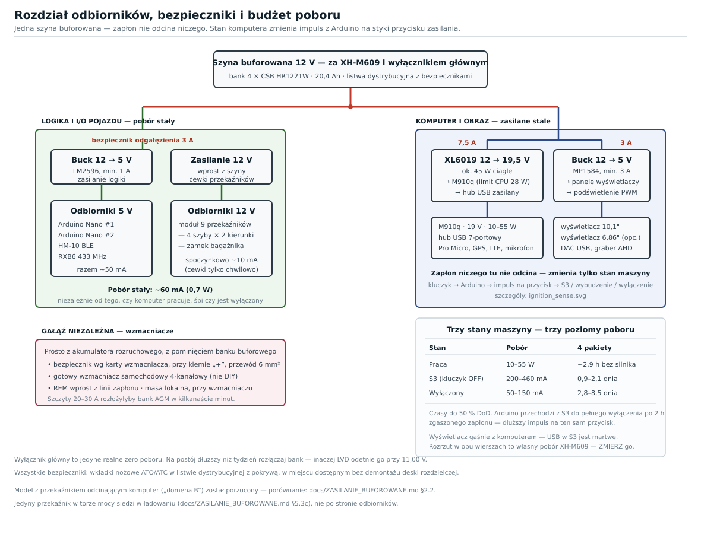
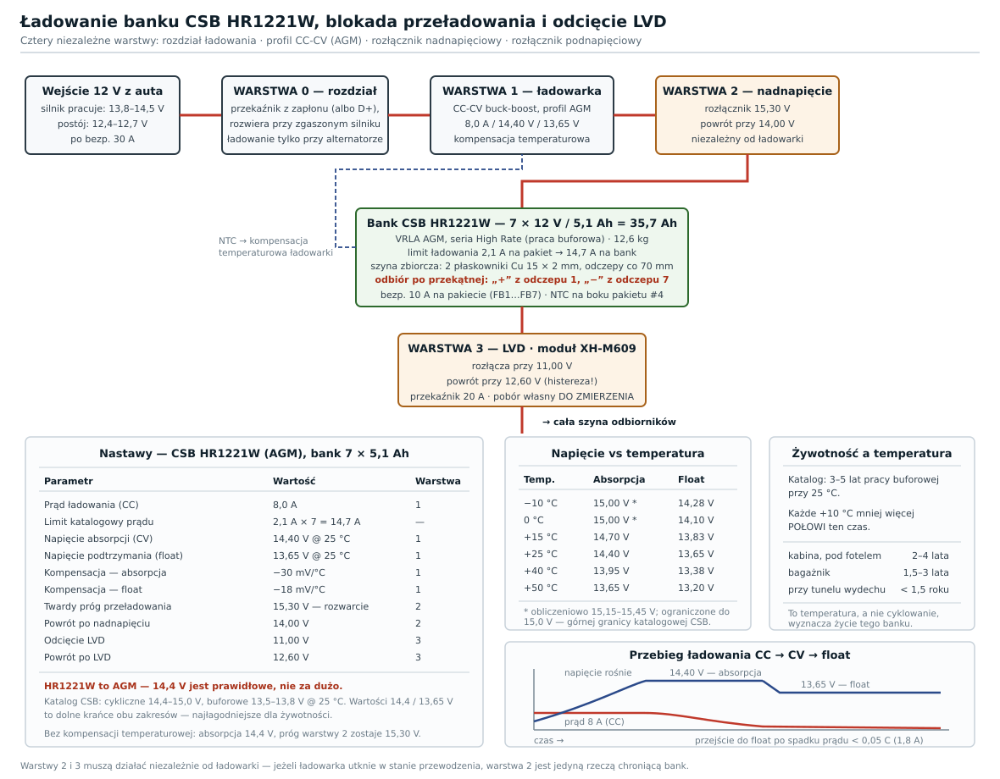

# Zasilanie buforowane — Lenovo M910q w Alfa Romeo 156

Kompletny opis układu zasilania head unitu BCM v8.5: bufor z akumulatorów
CSB HR1221W (AGM), ładowanie, blokada przeładowania, ochrona przed głębokim
rozładowaniem, podział na domeny i przetwornica step-up do 19 V.

**Schematy blokowe:** [`../schematics/power_buffered_m910q.svg`](../schematics/power_buffered_m910q.svg) ·
[`../schematics/charging_lvd.svg`](../schematics/charging_lvd.svg) ·
[`../schematics/power_domains_m910q.svg`](../schematics/power_domains_m910q.svg)

**Jak to pospiąć — zacisk po zacisku:** [`SCHEMATY_POLACZEN.md`](SCHEMATY_POLACZEN.md)

**Wdrożenie całości:** [`WDROZENIE_M910Q.md`](WDROZENIE_M910Q.md)

---

## Spis treści

1. [Po co bufor](#1-po-co-bufor)
2. [Architektura — dwie domeny](#2-architektura--dwie-domeny)
3. [Posiadana przetwornica step-up — weryfikacja](#3-posiadana-przetwornica-step-up--weryfikacja)
4. [Bank akumulatorów CSB HR1221W](#4-bank-akumulatorów-csb-hr1221w)
5. [Ładowanie — dwa warianty](#5-ładowanie--dwa-warianty)
6. [Blokada przeładowania](#6-blokada-przeładowania)
7. [LVD — ochrona przed głębokim rozładowaniem](#7-lvd--ochrona-przed-głębokim-rozładowaniem)
8. [Bezpieczniki, przekroje, masa](#8-bezpieczniki-przekroje-masa)
9. [Budżet energetyczny i czas postoju](#9-budżet-energetyczny-i-czas-postoju)
10. [Lista zakupowa](#10-lista-zakupowa)
11. [Procedura pierwszego uruchomienia](#11-procedura-pierwszego-uruchomienia)
12. [Serwis i kontrola okresowa](#12-serwis-i-kontrola-okresowa)
13. [Znane rozbieżności i luki](#13-znane-rozbieżności-i-luki)

---

## 1. Po co bufor

Trzy niezależne powody — każdy sam w sobie wystarczyłby:

| Problem | Bez bufora | Z buforem |
|---------|-----------|-----------|
| **Rozruch silnika** | Instalacja 12 V zapada na 6–8 V przez 200–600 ms. M910q gubi zasilanie i twardo się resetuje przy każdym przekręceniu kluczyka. | Bank trzyma szynę powyżej 12 V przez cały rozruch — komputer nawet nie mrugnie. |
| **Funkcje na postoju** | Pilot szyb 433 MHz i bramkowany BLE przycisk bagażnika muszą żyć non stop. Wpięte w akumulator rozruchowy rozładują go w kilka dni. | Domena A żyje z banku. Akumulator rozruchowy jest odizolowany i zawsze gotowy do rozruchu. |
| **Jakość napięcia** | Instalacja auta to śmietnik EMI: przepięcia od cewek, load dump z alternatora, tętnienia. | Bank o pojemności 25,5 Ah to gigantyczny kondensator — wygładza wszystko, co jest za nim. |

Kluczowa konsekwencja architektury: **akumulator rozruchowy nigdy nie zasila
head unitu na postoju**. Rozdziela je dioda albo przekaźnik VSR, więc auto
zawsze odpali, choćby bank był pusty.

---

## 2. Architektura — dwie domeny



| | **Domena A — zawsze zasilana** | **Domena B — za zapłonem** |
|---|---|---|
| **Źródło** | szyna buforowana (bank AGM) | szyna buforowana przez przekaźnik ACC |
| **Odbiorniki** | Arduino Nano #1 (output controller), Arduino Nano #2 (sensor hub), HM-10 BLE, RXB6 433 MHz, moduł 9 przekaźników | M910q, hub USB, oba wyświetlacze, Arduino Pro Micro, DAC USB, graber AHD |
| **Pobór spoczynkowy** | ~60 mA (0,7 W) | 0 mA — przekaźnik rozwarty |
| **Pobór w pracy** | ~60 mA + chwilowe załączenia cewek | ~10 W typowo, do ~55 W w szczycie |
| **Na postoju** | działa — nasłuchuje pilota i BLE | całkowicie odcięta |

**Dlaczego przekaźnik, a nie S3.** M910q obsługuje natywne S3 (~0,2 A przy
12 V ≈ 2,4 W), ale to i tak **czterdzieści razy więcej** niż cała domena A.
Przekaźnik rozwiera obwód fizycznie: zero poboru huba USB, zero upływów
przetwornic, zero ryzyka, że coś obudzi maszynę na parkingu. BCM budzi się
zimnym startem na ACC — startuje w ~15 s, co przy samochodzie jest
akceptowalne.

**Wzmacniacze idą osobną gałęzią** prosto z akumulatora rozruchowego
(bezpiecznik 20 A, przewód 4 mm²). TDA7388 przy średniej głośności ciągnie
6–8 A, w szczytach do 15–20 A — taki prąd rozłożyłby bank AGM w kilka
minut i całkowicie zniweczył jego rolę. Sygnał REM/standby wzmacniaczy bierz
z domeny B, żeby nie trzaskało w głośnikach przy załączaniu.

---

## 3. Posiadana przetwornica step-up — weryfikacja

Przetwornica jest już kupiona, więc zamiast doboru — **lista kontrolna**.
Trzeba ją przejść przed zabudową, bo to jedyny element toru, który zasila
komputer bezpośrednio.

### 3.1 Napięcie: 19 V czy 20 V?

Oryginalny zasilacz M910q to **20 V / 65 W**. Dokumentacja produkcyjna w tym
repozytorium (`docs/x86-production/02-assembly.html`) podaje, że **M910q
pracuje w zakresie 19–21 V i nie wystartuje poza nim**.

19 V mieści się w zakresie, ale leży **przy samej dolnej granicy**. Pod
obciążeniem dojdzie do tego:

- spadek na przewodzie step-up → wtyk (przy 3,5 A i 1,5 mm² na 1 m ≈ 0,04 V — pomijalny),
- spadek na samej przetwornicy przy wzroście obciążenia (regulacja obciążeniowa, typowo 1–3 %),
- spadek napięcia wejściowego, gdy bank schodzi w stronę LVD.

> **Ustaw wyjście na 19,5 V, nie 19,0 V.** Nadal bezpiecznie w zakresie
> 19–21 V, a daje ~0,5 V zapasu na zapady. Reguluj potencjometrem pod
> obciążeniem, nie na biegu jałowym, i po ustawieniu zabezpiecz śrubę
> kroplą lakieru do paznokci lub kleju — wibracje w aucie potrafią
> rozstroić potencjometr.

### 3.2 Obciążalność — policz, nie ufaj naklejce

| Wielkość | Wartość |
|----------|---------|
| Znamionowa moc M910q | 65 W |
| Prąd wyjściowy przy 19,5 V | 65 / 19,5 = **3,34 A** |
| Moc wejściowa przy sprawności 88 % | 65 / 0,88 = **73,9 W** |
| Prąd wejściowy przy 12,6 V (bank w spoczynku) | 73,9 / 12,6 = **5,9 A** |
| Prąd wejściowy przy 11,0 V (próg LVD) | 73,9 / 11,0 = **6,7 A** |

**Wymaganie: ≥ 3,5 A wyjścia i ≥ 7 A wejścia w pracy ciągłej.**

> **Uwaga na moduły „XL6019 150 W".** Sam układ XL6019 ma prąd klucza
> ok. 5 A. Przy 65 W wyjścia prąd klucza sięga ~7 A, czyli **powyżej
> katalogowej wartości**. Deklarowane „150 W" na modułach z AliExpress to
> zwykle szczyt przy maksymalnym napięciu wejściowym i z chłodzeniem,
> a nie ciągła praca. Jeżeli Twoja przetwornica stoi na XL6019, potraktuj
> ją jako **dobrą do typowego obciążenia (~25–35 W), ale ryzykowną
> w szczycie** — i koniecznie przejdź test z §3.4.
>
> Moduły oparte na kontrolerach z zewnętrznym MOSFET-em (typu „400 W 15 A
> boost") albo gotowa samochodowa ładowarka do laptopa 12 V → 19 V / 90 W
> mają tu dużo większy zapas. Jeśli test wypadnie źle, to jest kierunek
> wymiany.

Realny pobór M910q jest niższy niż znamionowe 65 W: i5-6400T ma TDP 35 W,
a system z dashboardem ciągnie zwykle 20–30 W. Szczyt 55 W pojawia się przy
dekodowaniu wideo z pełnym obciążeniem CPU. Bezpiecznik na wyjściu 19 V ma
mieć **5 A**.

### 3.3 Wtyk zasilania

M910q używa firmowego wtyku Lenovo (slim tip). Kupowanie „uniwersalnej"
końcówki to loteria — pasowanie mechaniczne i obecność środkowego pinu
identyfikacyjnego różnią się między wersjami.

**Najpewniejsze rozwiązanie: poświęć oryginalny zasilacz.** Odetnij kabel
30–40 cm od wtyku, sprawdź polaryzację multimetrem (środek = „+", ekran =
masa) i podłącz do wyjścia przetwornicy. Zyskujesz gwarantowane pasowanie
mechaniczne i oryginalny przewód o właściwym przekroju.

> **Pin identyfikacyjny.** W zasilaczach Lenovo slim-tip środkowy pin
> przenosi sygnał identyfikacyjny z układu w kostce zasilacza. Po odcięciu
> kabla ten sygnał znika. Laptopy ThinkPad wyświetlają wtedy ostrzeżenie
> i ograniczają ładowanie; **komputery ThinkCentre Tiny w praktyce startują
> normalnie**, ale tego nie da się założyć w ciemno dla konkretnej sztuki.
> Dlatego test z §3.4 jest obowiązkowy i musi się odbyć **przed** zabudową
> auta.

### 3.4 Test na biurku — obowiązkowy

Zanim cokolwiek trafi do samochodu:

```bash
# 1. Zasil przetwornicę z akumulatora 12 V (albo zasilacza laboratoryjnego
#    z limitem prądu 10 A). Wyjście USTAW NA 19,5 V bez obciążenia.
# 2. Podłącz M910q. Musi wystartować i wejść do systemu.
# 3. Obciąż CPU i sprawdź, czy napięcie się trzyma:
sudo apt install -y stress-ng
stress-ng --cpu 4 --timeout 600s
```

W trakcie testu mierz i zapisuj:

| Pomiar | Wartość dopuszczalna |
|--------|---------------------|
| Napięcie na wtyku M910q pod obciążeniem | **≥ 19,0 V** przez cały czas |
| Prąd wejściowy przetwornicy | zgodny z §3.2, bez pulsowania |
| Temperatura cewki i układu scalonego po 10 min | **< 85 °C** (bezdotykowo lub termoparą) |
| Stabilność systemu | brak resetów, brak wpisów o zaniku zasilania w `journalctl -b` |

**Powtórz test przy napięciu wejściowym 11,0 V** (symulacja rozładowanego
banku tuż przed progiem LVD). To najgorszy przypadek — największy prąd
wejściowy i największe grzanie.

Jeżeli którykolwiek pomiar wypadnie poza normę: dołóż radiator i wentylator
40 mm, a jeśli to nie pomoże — wymień przetwornicę na mocniejszą. Nie
próbuj tego „docisnąć" w aucie.

### 3.5 Chłodzenie i montaż

Przetwornica przy 65 W i sprawności 88 % rozprasza ~9 W. W zamkniętej
zabudowie za deską rozdzielczą, latem, to wystarczy do przegrzania.

- radiator na układzie scalonym i na cewce, klej termoprzewodzący,
- wentylator 40 mm zasilany z domeny B (5 V albo 12 V),
- montaż na blasze albo profilu aluminiowym pełniącym rolę radiatora,
- **nie** montuj płytki bezpośrednio na tapicerce ani wykładzinie.

---

## 4. Bank akumulatorów CSB HR1221W

### 4.1 Karta katalogowa

| Parametr | Wartość |
|----------|---------|
| Typ | **VRLA AGM** (separator z maty szklanej), seria **HR — High Rate** |
| Napięcie / cele | 12 V / 6 cel |
| Pojemność | **5,1 Ah** przy rozładowaniu 20-godzinnym |
| Moc | 21 W/celę przez 15 min do 1,67 V/celę |
| Zaciski | **F2** — nasuwka faston 6,35 mm |
| Wymiary | 90 × 70 × 101 mm |
| Masa | ~1,8 kg |
| Rezystancja wewnętrzna | ~23 mΩ |
| Maks. prąd rozładowania | 60 A przez 5 s |
| **Ładowanie buforowe (float)** | **13,5–13,8 V @ 25 °C** |
| **Ładowanie cykliczne** | **14,4–15,0 V @ 25 °C** |
| **Maks. prąd ładowania** | **2,1 A na pakiet** |
| Kompensacja temperaturowa | **−18 mV/°C** (float), **−30 mV/°C** (cykl) |
| Żywotność projektowa | **3–5 lat** pracy buforowej @ 25 °C |
| Żywotność cykliczna | **> 260 cykli** przy 100 % DoD |
| Samorozładowanie | > 75 % pojemności po 6 miesiącach @ 25 °C |

> **To jest akumulator AGM, nie żelowy.** Ma to bezpośrednie przełożenie
> na nastawy ładowania — patrz §4.4.

### 4.2 Konfiguracja banku

Pakiety łączone **równolegle** — napięcie zostaje 12 V, sumuje się pojemność.

| Liczba pakietów | Pojemność | Masa | Maks. prąd ładowania | Uwagi |
|-----------------|-----------|------|---------------------|-------|
| 4 | 20,4 Ah | 7,2 kg | 8,4 A | minimum sensowne |
| **5** | **25,5 Ah** | **9,0 kg** | **10,5 A** | **optimum — zalecane** |
| 6 | 30,6 Ah | 10,8 kg | 12,6 A | jeśli jest miejsce |
| 8 | 40,8 Ah | 14,4 kg | 16,8 A | przemyśl, czy 14 kg w aucie jest warte 5 dni więcej |

Notatki w repozytorium mówią o **ośmiu posiadanych pakietach**. Użycie pięciu
daje optimum, a trzy zostają jako zapas — pakiety starzeją się też leżąc, więc
rotacja jest korzystna.

Pięć pakietów obok siebie zajmuje ok. **350 × 90 × 101 mm** (bokiem, szerokość
70 mm każdy) plus miejsce na przewody i pasy.

### 4.3 Zasady łączenia równoległego

Nierówne łączenie równoległe to najczęstszy powód, dla którego bank umiera
przedwcześnie: pakiet z najniższą rezystancją bierze na siebie większość prądu
i wykańcza się pierwszy.

- **jednakowe pakiety** — ten sam model i najlepiej ta sama dostawa
  (zbliżony wiek i partia produkcyjna),
- **jednakowe przewody** — identyczna długość i przekrój od każdego pakietu
  do szyny, nawet jeśli fizycznie leżą różnie,
- **łączenie po przekątnej** — pobór z „+" pierwszego pakietu i „−" ostatniego,
  albo (lepiej) dedykowana szyna/mostek miedziany, do którego wszystkie pakiety
  wpinają się osobno,
- **bezpiecznik 10 A na dodatnim biegunie każdego pakietu** — zwarta cela
  w jednym pakiecie nie zabiera wtedy całej szyny,
- **nie dokładaj nowego pakietu do starego banku** — wyrównuj cały komplet.

**Zaciski F2 w samochodzie.** Nasuwki 6,35 mm prądowo wystarczają z ogromnym
zapasem (bezpiecznik 10 A jest tu elementem ograniczającym), ale w aucie
problemem są wibracje:

- nasuwki żeńskie 6,35 mm **w pełni izolowane**, zaciskane zaciskarką
  zapadkową — nie kombinerkami,
- koszulka termokurczliwa z klejem na całym połączeniu,
- **odciążenie mechaniczne**: wiązkę przypnij opaską do skrzynki, żeby ciężar
  przewodu nie wisiał na nasuwce,
- odrobina smaru stykowego przeciw korozji ciernej (fretting).

### 4.4 AGM — nastawy ładowania

Ponieważ HR1221W to AGM, obowiązują wartości z karty katalogowej CSB:

| Parametr | Zakres katalogowy | **Przyjęta nastawa** | Dlaczego |
|----------|------------------|---------------------|----------|
| Absorpcja (cykl) | 14,4–15,0 V | **14,40 V** | dolny kraniec — najłagodniejszy dla żywotności |
| Podtrzymanie (float) | 13,5–13,8 V | **13,65 V** | środek zakresu |
| Prąd ładowania | maks. 2,1 A/pakiet | **6,0 A** dla 5 pakietów | 57 % katalogowego limitu 10,5 A |

> **Korekta wcześniejszej wersji tego dokumentu.** Wcześniejsze wydanie
> zakładało akumulatory żelowe i podawało 14,20 V / 13,70 V oraz ostrzeżenie,
> że 14,4 V jest za dużo. **Dla HR1221W jest inaczej: 14,4 V mieści się
> w katalogowym zakresie cyklicznym**, a wartości 15–20 A z oryginalnych
> notatek repo są za wysokie nie dlatego, że to żel, tylko dlatego, że limit
> katalogowy wynosi 2,1 A na pakiet (10,5 A na bank pięciu).

**Seria HR to akumulator buforowy, nie trakcyjny.** Konstrukcja z cienkimi
płytami jest zoptymalizowana pod krótkie rozładowania dużym prądem (UPS) —
i to akurat **bardzo dobrze pasuje** do roli bufora rozruchowego: rezystancja
23 mΩ na pakiet daje po zrównolegleniu 4,6 mΩ, więc pobór 7 A przez step-up
powoduje spadek zaledwie ~32 mV. Czego HR nie lubi, to **głębokie cyklowanie**
— stąd LVD i dyscyplina DoD z §9.

### 4.5 Kompensacja temperaturowa

CSB podaje **dwa różne współczynniki**:

| Tryb | Współczynnik (blok 12 V) |
|------|-------------------------|
| Ładowanie buforowe (float) | **−18 mV/°C** |
| Ładowanie cykliczne (absorpcja) | **−30 mV/°C** |

| Temperatura | Absorpcja | Float |
|-------------|-----------|-------|
| −10 °C | 15,00 V * | 14,28 V |
| 0 °C | 15,00 V * | 14,10 V |
| +15 °C | 14,70 V | 13,83 V |
| **+25 °C** | **14,40 V** | **13,65 V** |
| +40 °C | 13,95 V | 13,38 V |
| +50 °C | 13,65 V | 13,20 V |

\* obliczeniowo 15,15 V (0 °C) i 15,45 V (−10 °C), ale **ograniczone do 15,0 V**
— górnej granicy katalogowej CSB. Ładowarka, która nie ma takiego ograniczenia,
przy mrozie wyjedzie ponad kartę katalogową.

Czujnik NTC 10 kΩ przyklej do **boku obudowy pakietu w środku banku** (nie na
skrajnym, nie na biegunie).

### 4.6 Temperatura, nie cyklowanie, wyznacza żywotność

Karta podaje **3–5 lat pracy buforowej przy 25 °C**. Reguła Arrheniusa dla
akumulatorów ołowiowych: **każde +10 °C mniej więcej połowi ten czas.**

| Miejsce montażu | Szacowana żywotność |
|-----------------|--------------------|
| kabina, pod fotelem / za panelem | 2–4 lata |
| bagażnik | 1,5–3 lata |
| przy tunelu wydechowym | < 1,5 roku |

Dla porównania strona cykliczna: > 260 cykli przy 100 % DoD, czyli grubo ponad
500 cykli przy 50 % DoD. Nawet gdybyś co tydzień schodził do 50 % DoD, to
~50 cykli rocznie — cyklowanie wyczerpie się po dekadzie, a kalendarz i ciepło
znacznie wcześniej.

**Wniosek praktyczny: miejsce montażu ma większy wpływ na żywotność banku niż
dyscyplina rozładowania.** Kabina bije bagażnik.

### 4.7 Montaż mechaniczny

- miejsce montażu: **pod fotelem pasażera**, nie w bagażniku — patrz
  [`../schematics/vehicle_layout_m910q.svg`](../schematics/vehicle_layout_m910q.svg),
- pakiety w **skrzynce lub na wsporniku**, przypięte pasami — 5 × 1,8 kg
  luzem w bagażniku to pocisk przy hamowaniu,
- pozycja: AGM toleruje dowolną orientację poza **do góry nogami**;
  stojąco albo leżąco na boku,
- **jak najdalej od źródeł ciepła** — patrz §4.6, to nie jest porada
  kosmetyczna,
- dostęp do zacisków bez demontażu połowy auta — będą potrzebne przy
  pomiarach okresowych,
- AGM jest szczelny (VRLA, rekombinacja gazów), więc montaż w kabinie jest
  dozwolony — ale **skrzynki nie zamykaj hermetycznie**. Przy awarii ładowania
  zawór bezpieczeństwa wypuszcza wodór; potrzebna jest szczelina wentylacyjna.

---

## 5. Ładowanie — dwa warianty



### 5.1 Dlaczego zwykły buck DC-DC tu nie zadziała

Starsze notatki w repozytorium proponują moduł **buck** (XL4016) między diodą
a bankiem. To nie może działać poprawnie, i warto wiedzieć dlaczego:

```
alternator             14,4 V
− spadek na przewodach −0,2 V
− dioda Schottky       −0,45 V
─────────────────────────────
wejście przetwornicy   13,75 V
```

Przetwornica **buck obniża napięcie** — z 13,75 V nie zrobi 14,40 V absorpcji.
Bank nigdy nie dojdzie powyżej ~13,5 V, czyli utknie na ~85 % pojemności
i nigdy się w pełni nie naładuje.

Potrzebna jest topologia, która **potrafi podnieść napięcie**: buck-boost,
SEPIC albo zwykły boost o małym przełożeniu.

### 5.2 Wariant A — gotowa ładowarka DC-DC (zalecany)

Samochodowa ładowarka DC-DC („B2B", battery-to-battery) rozwiązuje w jednym
pudełku wszystko: topologię buck-boost, limit prądu, profil wielostopniowy
z presetem **AGM**, kompensację temperaturową i detekcję pracy alternatora.

| Model | Prąd | Orientacyjna cena | Uwagi |
|-------|------|------------------|-------|
| Victron Orion-Tr Smart 12/12-18 | 18 A | ~800–1000 PLN | konfiguracja przez Bluetooth, preset AGM, izolowana |
| Victron Orion XS 12/12-50 | 50 A | ~1200–1500 PLN | mocno przewymiarowana dla 25,5 Ah |
| Redarc BCDC1225D | 25 A | ~1300–1600 PLN | bardzo odporna, popularna w off-roadzie |
| Sterling BB1230 | 30 A | ~900–1200 PLN | |

Prąd nastaw i tak na **6 A** (katalogowy sufit dla pięciu HR1221W to 10,5 A)
— większy model to tylko zapas i mniejsze grzanie. Dla banku 25,5 Ah
**najmniejsza dostępna wersja w zupełności wystarcza**.

**Co odpada przy wariancie A:** VSR (ładowarka sama wykrywa pracę silnika),
dioda Schottky (izolacja jest w środku), osobny czujnik NTC (jest wbudowany
albo w komplecie).

### 5.3 Wariant B — DIY

Tańszy, ale wymaga uwagi przy nastawianiu i regularnej kontroli.

```
akumulator → bezp. 30 A → VSR → moduł CC-CV boost → blokada nadnapięcia → bank
```

| Element | Rola | Nastawa | Cena |
|---------|------|---------|------|
| **VSR** (voltage sensitive relay) 12 V / 140 A | zwiera obwód dopiero, gdy alternator pracuje | zał. 13,3 V, wył. 12,8 V | 60–120 PLN |
| **Moduł CC-CV boost** 300 W / 10 A z regulacją prądu i napięcia | podnosi 13,75 V → 14,4 V i limituje prąd | CV 14,40 V, CC 6,0 A | 60–100 PLN |

**Dlaczego VSR, a nie dioda Schottky.** Boost nie może dawać napięcia
niższego niż wejściowe — przy zgaszonym silniku (12,4 V na akumulatorze
rozruchowym) próbowałby dalej podawać 14,2 V i **rozładowywałby akumulator
auta**. VSR fizycznie rozłącza obwód poniżej 12,8 V, więc problem znika.
Dodatkowo odpada spadek 0,45 V na diodzie, którego przy tak małym przełożeniu
bardzo brakuje.

Jeżeli mimo wszystko zostajesz przy diodzie Schottky (MBR2045), to **musisz**
dołożyć przekaźnik sterowany z ACC, który odcina ładowarkę przy zgaszonym
silniku.

**Kompensacja temperaturowa w wariancie B** jest ręczna: tanie moduły CC-CV
jej nie mają. Praktyczne obejście — ustaw CV na **13,8 V**, czyli górny kraniec
katalogowego zakresu buforowego, i zrezygnuj z fazy absorpcji. Bank będzie
ładowany do ~90 % zamiast 100 %, ale **nie zostanie przeładowany nawet przy
50 °C w bagażniku** (13,8 V bez kompensacji odpowiada wtedy mniej więcej
prawidłowemu float). Dla pracy buforowej to bardzo dobry kompromis, a przy
takiej nastawie próg warstwy 2 obniż do **14,80 V**.

### 5.4 Ochrona wejścia

Instalacja 12 V auta bywa brudna elektrycznie. Na **wejściu ładowarki**
(strona od akumulatora rozruchowego):

- **dioda TVS** 1.5KE33CA albo SMCJ26CA równolegle do wejścia — obcina
  load dump z alternatora,
- **kondensator elektrolityczny** 470 µF / 35 V równolegle — wygładza
  tętnienia i pomaga przy zapadach,
- sprawdź w karcie katalogowej modułu **maksymalne napięcie wejściowe** —
  jeśli to 30 V, to przy load dumpie bez TVS zostanie z niego dym.

---

## 6. Blokada przeładowania

To jest ta warstwa, o którą pytasz wprost — i jest **oddzielna od ładowarki**.

### 6.1 Dlaczego osobny element

Etap CV w ładowarce to warstwa pierwsza i w normalnej pracy w zupełności
wystarcza. Problem pojawia się przy **awarii ładowarki**: przebity tranzystor
klucza zwiera wejście z wyjściem i na bank idzie pełne napięcie alternatora
(14,5 V, przy uszkodzonym regulatorze nawet 16 V+) bez żadnego ograniczenia.
Bank AGM w takim reżimie gotuje się w kilkanaście godzin.

Rozłącznik nadnapięciowy jest **niezależnym urządzeniem**, które mierzy
napięcie na banku i rozwiera obwód ładowania, gdy przekroczy próg.

### 6.2 Nastawy

| Parametr | Wartość | Uzasadnienie |
|----------|---------|--------------|
| Próg rozwarcia | **15,30 V** | powyżej katalogowego maksimum 15,0 V, poniżej napięcia, przy którym AGM intensywnie odgazowuje |
| Próg powrotu | **14,00 V** | poniżej absorpcji — nie klapkuje w kółko |
| Zwłoka zadziałania | 1–3 s | ignoruje krótkie piki, reaguje na realne przeładowanie |
| Obciążalność styków | ≥ 10 A | musi przenieść prąd ładowania z zapasem |

### 6.3 Realizacja

**Moduł programowalnego przekaźnika napięciowego** (na rynku jako „DC 6–30 V
programmable voltage control relay", np. XY-WJ01 lub odpowiednik z wyświetlaczem):
ustawiasz próg załączenia i wyłączenia, moduł steruje przekaźnikiem. Koszt
40–80 PLN.

> **Sprawdź kierunek działania.** Większość tanich modułów jest fabrycznie
> skonfigurowana jako ochrona **podnapięciowa** (załącz powyżej progu).
> Potrzebujesz trybu odwrotnego: **rozwarcie powyżej progu**. Część modułów
> ma to jako tryb pracy (F-1/F-2), część wymaga użycia styku NC zamiast NO.
> Zweryfikuj na stole zasilaczem laboratoryjnym, zanim wepniesz to w auto.

Jeżeli styki modułu nie wyrabiają prądowo — steruj nimi **przekaźnik
mocy 30 A** (ten sam typ, co przekaźnik zapłonu).

**Wariant A i tak potrzebuje tej warstwy.** Ładowarka Victron/Redarc jest
bardzo niezawodna, ale nie jest niezniszczalna — a komplet pięciu HR1221W
jest wielokrotnie droższy niż moduł za 60 PLN.

### 6.4 Kontrola „na sucho"

Po zamontowaniu, przed podłączeniem banku:

1. Zasilacz laboratoryjny na wejście modułu, wolno podnoś napięcie.
2. Przy 15,30 V ± 0,05 V przekaźnik musi **rozewrzeć**.
3. Obniżaj — przy 14,00 V musi **zewrzeć z powrotem**.
4. Powtórz trzy razy; próg nie może pływać o więcej niż 0,05 V.

---

## 7. LVD — ochrona przed głębokim rozładowaniem

Druga strona medalu: bank nie może zejść zbyt nisko, bo siarczanowanie płyt
przy głębokim rozładowaniu jest równie nieodwracalne, co przeładowanie.

| Parametr | Wartość |
|----------|---------|
| Próg odcięcia | **11,00 V** |
| Próg powrotu | **12,60 V** |
| Obciążalność | ≥ 30 A (przenosi całą szynę) |
| Pobór własny | < 10 mA (wlicza się w budżet domeny A) |

**Histereza jest obowiązkowa.** Po odcięciu obciążenia napięcie banku
„odbija" o 0,3–0,5 V. Moduł bez histerezy zacznie klapkować z częstotliwością
kilku Hz i w krótkim czasie spali styki. Próg powrotu 12,60 V oznacza, że
szyna wróci dopiero po realnym doładowaniu z alternatora.

**Co odcina LVD.** Całą szynę — obie domeny. Domena A też przestaje działać
(pilot szyb i BLE bagażnika nie odpowiadają), ale to celowe: bank przetrwa
i naładuje się przy następnym uruchomieniu silnika. Alternatywa — pozwolić
Nano dojechać bank do 9 V — kończy się wymianą kompletu pakietów.

Moduł LVD montuj **za bankiem, przed rozgałęzieniem domen** — patrz
[`power_buffered_m910q.svg`](../schematics/power_buffered_m910q.svg).

---

## 8. Bezpieczniki, przekroje, masa

### 8.1 Bezpieczniki

| Bezpiecznik | Wartość | Umiejscowienie |
|-------------|---------|----------------|
| Główny | 30 A | **maks. 30 cm od klemy „+"** akumulatora rozruchowego |
| Na pakiet banku | 10 A × 5 | na zacisku F2 „+" każdego pakietu |
| Wyjście step-up | 5 A | między przetwornicą a wtykiem M910q |
| Odgałęzienie domeny A | 3 A | przed buckiem 12 → 5 V |
| Odgałęzienie wyświetlaczy | 3 A | przed buckiem 12 → 5 V domeny B |
| Gałąź wzmacniaczy | 20 A | osobno, przy klemie akumulatora rozruchowego |

Bezpiecznik główny **przy klemie**, nie przy urządzeniu — zwarcie przewodu
o karoserię w połowie trasy ma być przerwane przy źródle, inaczej cały
przewód staje się grzałką. Wkładki nożowe ATO/ATC w listwie dystrybucyjnej
z pokrywą, w miejscu dostępnym bez demontażu deski rozdzielczej.

### 8.2 Przekroje przewodów

Dla trasy ok. 3 m (komora silnika → deska rozdzielcza) przy spadku < 3 %:

| Odcinek | Prąd | Przekrój |
|---------|------|----------|
| Akumulator → bezpiecznik → VSR/ładowarka | do 30 A | **6 mm²** |
| Ładowarka → bank | do 6 A | 2,5 mm² |
| Pakiet HR1221W → szyna | do 10 A | 1,5 mm² |
| Szyna → LVD → przekaźnik → step-up | do 7 A | 2,5 mm² |
| Step-up → M910q | 3,5 A @ 19 V | 1,5 mm² |
| Odgałęzienie domeny A | < 1 A | 0,75 mm² |
| Gałąź wzmacniaczy | do 20 A | 4 mm² |
| Masa do nadwozia | — | **6 mm²** |

Przewody samochodowe (FLRY/FLY), nie instalacyjne YDY — potrzebna jest
linka, nie drut, i izolacja odporna na temperaturę i oleje.

### 8.3 Masa

- **jeden punkt masy** dla całego head unitu — gwiazda, nie łańcuszek,
- śruba do gołego metalu nadwozia, powierzchnia oczyszczona ze szpachli
  i lakieru, po dokręceniu zabezpieczona wazeliną techniczną,
- masa banku, masa M910q, masa Arduino i masa audio schodzą się **w tym
  jednym punkcie**,
- masa wzmacniaczy osobno, blisko wzmacniaczy — inaczej dostaniesz pętlę
  masy i przydźwięk alternatora w głośnikach.

### 8.4 Praktyka montażowa

- przejścia przez blachę **zawsze** przez przelotkę gumową,
- wiązki w peszlu/oplocie, mocowane co 30 cm,
- konektory zaciskane właściwą zaciskarką i dodatkowo koszulka
  termokurczliwa z klejem; lutowanie w miejscach narażonych na wibracje
  łamie się przy wyjściu z lutu,
- zapas długości przy każdym urządzeniu (pętla serwisowa),
- **wyłącznik główny masy** banku (rozłącznik 100 A) — bardzo ułatwia
  serwis i jest wymagany, jeśli auto stanie na dłużej.

---

## 9. Budżet energetyczny i czas postoju

### 9.1 Pobór domeny A

| Element | Pobór |
|---------|-------|
| Arduino Nano #1 (output controller) | ~25 mA |
| HM-10 BLE (nasłuch) | ~15 mA |
| RXB6 433 MHz (nasłuch) | ~5 mA |
| Moduł przekaźników (spoczynek) | ~10 mA |
| Straty przetwornic + LVD | ~5 mA |
| **Razem** | **~60 mA (0,7 W)** |

### 9.2 Czas postoju

| Pakiety | Pojemność | Do 30 % DoD (zalecane) | Do 50 % DoD | Do progu LVD 11,0 V |
|---------|-----------|------------------------|-------------|---------------------|
| 4 | 20,4 Ah | ~4,3 dnia | ~7,1 dnia | ~10,6 dnia |
| **5** | **25,5 Ah** | **~5,3 dnia** | **~8,9 dnia** | **~13,3 dnia** |
| 6 | 30,6 Ah | ~6,4 dnia | ~10,6 dnia | ~15,9 dnia |
| 8 | 40,8 Ah | ~8,5 dnia | ~14,2 dnia | ~21,3 dnia |

Kolumna 30 % DoD jest dodana, bo HR1221W to seria buforowa (UPS), a nie
trakcyjna — płytsze rozładowanie wyraźnie wydłuża jej życie. Przy okazjonalnym
dłuższym postoju 50 % DoD jest w porządku; jako **rutyna** lepiej trzymać 30 %.

> **Korekta wobec starszych notatek.** `docs/X86_PLATFORM_SETUP.md` § 2.3
> i `10-power-suspend.html` podają dla banku 25 Ah „~17 dni" z adnotacją
> „ograniczone do 50 % DoD". Te dwie rzeczy się wykluczają: 25 Ah / 0,060 A
> = 417 h = 17,4 dnia to **pełne rozładowanie do zera**. Przy realnym
> ograniczeniu do 50 % DoD i faktycznej pojemności 25,5 Ah wychodzi
> 12,75 Ah / 0,060 A = 212 h = **8,9 dnia**. Tabela powyżej rozdziela
> wszystkie trzy przypadki.

Samorozładowanie HR1221W (> 75 % pojemności po 6 miesiącach @ 25 °C, czyli
≤ 4 %/miesiąc) odpowiada ok. **1,4 mA** przy banku 25,5 Ah — wobec 60 mA
domeny A jest pomijalne. W upale rośnie kilkukrotnie, ale nadal nie zmienia
obrazu.

Kolumna „do progu LVD" zakłada zejście do ~75 % DoD (11,0 V pod bardzo
lekkim obciążeniem). Jest osiągalna, ale każde takie zejście kosztuje
żywotność — traktuj ją jako rezerwę awaryjną, nie tryb normalnej pracy.

### 9.3 Budzenie RTC

Jeśli włączysz budzenie M910q z RTC (np. co 15 min na ping pozycji), dolicz
ok. 5 Ah tygodniowo — to **mniej więcej połowi** powyższe czasy. Przy dłuższym
postoju wyłącz je z UI.

### 9.4 Ładowanie po postoju

Bank rozładowany do 50 % (12,75 Ah do uzupełnienia) przy prądzie ładowania
6 A potrzebuje ~2,2 h w fazie CC plus ~2 h absorpcji — czyli **około
4–5 godzin jazdy**. Podniesienie prądu do katalogowego sufitu 10,5 A skraca
fazę CC do ~1,3 h, ale absorpcja i tak trwa swoje. Krótkie przejazdy po mieście nie doładują banku po
dłuższym postoju; jeśli tak wygląda Twój profil użytkowania, rozważ
ładowarkę sieciową na czas parkowania w garażu.

---

## 10. Lista zakupowa

### 10.1 Już posiadane

| Element | Uwaga |
|---------|-------|
| Przetwornica step-up 12 → 19 V | **do weryfikacji wg §3** — ustaw na 19,5 V |
| Akumulatory **CSB HR1221W F2** (12 V / 5,1 Ah AGM) × 8 | użyj 5 (25,5 Ah), reszta jako zapas |
| Lenovo ThinkCentre M910q Tiny | |

### 10.2 Do dokupienia — obowiązkowe

| # | Element | Specyfikacja | Szt. | Cena (PLN) |
|---|---------|--------------|------|-----------|
| 1 | **Ładowarka DC-DC** *(wariant A)* | Victron Orion-Tr Smart 12/12-18 lub odpowiednik z presetem **AGM** | 1 | 800–1000 |
| | *albo:* VSR + moduł CC-CV boost *(wariant B)* | VSR 12 V/140 A + boost 300 W/10 A z regulacją CC i CV | 1+1 | 120–220 |
| 2 | **Rozłącznik nadnapięciowy** | programowalny przekaźnik napięciowy, próg 15,3 V / powrót 14,0 V | 1 | 40–80 |
| 3 | **Moduł LVD** | odcięcie 11,0 V, powrót 12,6 V, ≥ 30 A, z histerezą | 1 | 30–60 |
| 4 | **Przekaźnik zapłonu** | Bosch 12 V / 30 A SPDT + podstawka | 1 | 15–25 |
| 5 | **Przekaźnik mocy** (do poz. 2, jeśli styki modułu za słabe) | 12 V / 30 A + podstawka | 1 | 15–25 |
| 6 | **Listwa dystrybucyjna bezpiecznikowa** | 6–8 obwodów ATO/ATC, z pokrywą | 1 | 40–70 |
| 7 | **Bezpiecznik główny + oprawka** | 30 A, oprawka do montażu przy klemie | 1 | 15–25 |
| 8 | **Bezpieczniki inline** | 10 A × 5 (pakiety) + oprawki | 5 | 15–25 |
| 9 | **Bezpieczniki nożowe** | 5 A, 3 A × 2, 20 A + zapas | kpl. | 10–15 |
| 10 | **Buck 12 → 5 V** (domena A) | LM2596, min. 1 A | 1 | 5–10 |
| 11 | **Buck 12 → 5 V** (wyświetlacze) | MP1584 / MP2307, min. 3 A | 1 | 5–15 |
| 12 | **Dioda TVS** | 1.5KE33CA lub SMCJ26CA | 2 | 5–10 |
| 13 | **Kondensator elektrolityczny** | 470 µF / 35 V, low-ESR, 105 °C | 2 | 5–10 |
| 14 | **Dioda gaszeniowa** | 1N4007 (na cewki przekaźników) | 5 | 2–5 |
| 15 | **Przewód 6 mm²** | FLRY, czerwony 4 m + czarny 2 m | — | 60–90 |
| 16 | **Przewód 2,5 mm²** | FLRY, czerwony + czarny, po 3 m | — | 25–40 |
| 17 | **Przewód 1,5 mm²** | FLRY, czerwony + czarny, po 3 m | — | 15–25 |
| 18 | **Przewód 0,75 mm²** | FLRY, kilka kolorów, po 2 m | — | 15–25 |
| 19 | **Konektory oczkowe M6/M8** | do 6 mm², zaciskane | 10 | 15–25 |
| 20 | **Konektory / tulejki / koszulki** | zestaw, koszulki z klejem | kpl. | 30–50 |
| 21 | **Peszel / oplot + przelotki gumowe** | 5 m peszla + komplet przelotek | kpl. | 25–40 |
| 22 | **Skrzynka / wspornik na bank + pasy** | na 5 pakietów, mocowanie do nadwozia | 1 | 60–120 |
| 23 | **Rozłącznik masy** | 100 A, kluczykowy lub pokrętło | 1 | 40–70 |
| 24 | **Radiator + wentylator 40 mm** | do przetwornicy step-up | kpl. | 20–35 |
| | | | **Razem wariant A** | **~1300–1900 PLN** |
| | | | **Razem wariant B** | **~600–1100 PLN** |

### 10.3 Do dokupienia — zalecane

| # | Element | Po co | Cena (PLN) |
|---|---------|-------|-----------|
| 25 | **Czujnik NTC 10 kΩ** | kompensacja temperaturowa (wariant B) | 5–10 |
| 26 | **Woltomierz/amperomierz z bocznikiem 50 A** | podgląd stanu banku bez multimetru | 40–70 |
| 27 | **Multimetr z pomiarem prądu DC 10 A** | pomiary przy uruchomieniu i serwisie | 80–200 |
| 28 | **Ładowarka sieciowa AGM** | doładowanie w garażu przy krótkich przejazdach | 150–300 |
| 29 | **Zaciskarka do konektorów** | zaciski niepewne to najczęstsza usterka instalacji | 60–150 |

### 10.4 Czego **nie** kupować

| Element | Dlaczego |
|---------|----------|
| Moduł buck XL4016 jako ładowarka | nie podniesie napięcia do absorpcji — patrz §5.1 |
| Dioda krzemowa (1N5408 itp.) zamiast Schottky | spadek 0,7–1,0 V zjada całą rezerwę napięcia |
| „Uniwersalna" końcówka do M910q | pasowanie i pin ID to loteria — patrz §3.3 |
| Ładowarka/BMS do LiFePO₄ lub Li-ion | zupełnie inne napięcia — zniszczy bank AGM |
| Akumulatory rozruchowe zamiast HR1221W | nie znoszą pracy cyklicznej, umrą w kilka miesięcy |
| Ładowarka z presetem GEL | profil żelowy jest ~0,2–0,3 V niższy — bank AGM nigdy nie dojdzie do pełna |

---

## 11. Procedura pierwszego uruchomienia

Kolejność jest istotna — każdy etap kończy się pomiarem, a bank podłączasz
dopiero, gdy wszystko przed nim jest zweryfikowane.

### Etap 1 — nastawy na stole (bez auta, bez banku)

```
[ ] Przetwornica step-up: wyjście 19,5 V bez obciążenia (multimetr)
[ ] Test obciążeniowy step-up wg §3.4 — 10 min stress-ng, napięcie ≥ 19,0 V
[ ] Powtórka testu przy wejściu 11,0 V
[ ] Ładowarka: CV 14,40 V (lub 13,80 V w wariancie B bez kompensacji)
[ ] Ładowarka: limit prądu CC 6,0 A (sufit katalogowy 10,5 A dla 5 pakietów)
[ ] Rozłącznik nadnapięciowy: rozwarcie 15,30 V, powrót 14,00 V (§6.4)
[ ] LVD: odcięcie 11,00 V, powrót 12,60 V
[ ] Buck domeny A: wyjście 5,0 V
[ ] Buck wyświetlaczy: wyjście 5,0 V
```

### Etap 2 — bank

```
[ ] Pomiar napięcia spoczynkowego każdego pakietu osobno
    (rozrzut > 0,2 V = pakiet do odrzucenia)
[ ] Doładowanie wszystkich pakietów do tego samego napięcia PRZED łączeniem
[ ] Bezpiecznik 10 A na „+" każdego pakietu
[ ] Łączenie równoległe — jednakowe przewody, szyna/mostek
[ ] Pomiar napięcia banku po połączeniu
[ ] Czujnik NTC przyklejony do środkowego pakietu
```

### Etap 3 — montaż w aucie, bez podłączenia do akumulatora

```
[ ] Skrzynka banku zamocowana i przypięta pasami
[ ] Punkt masy przygotowany (goły metal, śruba, wazelina)
[ ] Trasy przewodów przepięte, przelotki w blachach
[ ] Listwa bezpiecznikowa zamontowana w dostępnym miejscu
[ ] Rozłącznik masy banku w pozycji ROZWARTY
[ ] Wszystkie połączenia sprawdzone wizualnie i pociągnięciem
```

### Etap 4 — pierwsze załączenie

```
[ ] Bezpiecznik główny 30 A WYJĘTY
[ ] Podłączenie masy do nadwozia
[ ] Podłączenie „+" do klemy akumulatora rozruchowego
[ ] Włożenie bezpiecznika głównego — obserwuj, czy nic nie iskrzy/grzeje
[ ] Pomiar: napięcie na szynie buforowanej (silnik zgaszony)
[ ] Rozłącznik masy banku ZWARTY
[ ] Pomiar: napięcie banku = napięcie szyny
[ ] Pomiar prądu spoczynkowego domeny A → oczekiwane ~60 mA
    (rozbieżność > 100 mA = szukaj upływu, NIE jedź dalej)
```

### Etap 5 — silnik i ładowanie

```
[ ] Uruchomienie silnika
[ ] Pomiar: napięcie na akumulatorze rozruchowym (13,8–14,5 V)
[ ] Pomiar: VSR zwarty / ładowarka aktywna
[ ] Pomiar: prąd ładowania banku ≤ 6 A
[ ] Pomiar: napięcie banku rośnie, nie przekracza 14,40 V (wg kompensacji temp.)
[ ] Po 30 min: temperatura pakietów ręką — letnie, nie gorące
[ ] Zgaszenie silnika → VSR rozwiera się w ciągu kilku sekund
[ ] Pomiar: brak prądu z banku do akumulatora rozruchowego
```

### Etap 6 — domena B i komputer

```
[ ] Przekręcenie kluczyka na ACC → przekaźnik zapłonu zwiera
[ ] Pomiar: 19,5 V na wtyku M910q
[ ] M910q startuje, dashboard pojawia się na wyświetlaczu głównym
[ ] Rozruch silnika przy działającym BCM → komputer NIE resetuje się
    (to jest test, dla którego cały ten bufor powstał)
[ ] Wyłączenie zapłonu → domena B gaśnie, pomiar poboru = 0 mA
[ ] Domena A dalej działa — test pilota 433 MHz i BLE bagażnika
```

### Etap 7 — próba postoju

```
[ ] Auto zaparkowane na 48 h bez uruchamiania
[ ] Pomiar napięcia banku przed i po
[ ] Spadek zgodny z ~60 mA (dla 25,5 Ah: ok. 2,9 Ah = ~0,2–0,3 V)
[ ] Akumulator rozruchowy bez zmian — auto odpala normalnie
```

---

## 12. Serwis i kontrola okresowa

| Częstotliwość | Czynność | Kryterium |
|---------------|----------|-----------|
| Co miesiąc | Napięcie banku po nocy postoju | > 12,4 V |
| Co 3 miesiące | Napięcie każdego pakietu osobno | rozrzut < 0,2 V |
| Co 3 miesiące | Dokręcenie połączeń na szynie i biegunach | bez luzu |
| Co 6 miesięcy | Napięcie ładowania przy pracującym silniku | ≤ 14,40 V (lub wg kompensacji) |
| Co 6 miesięcy | Prąd spoczynkowy domeny A | ~60 mA ± 20 % |
| Co 12 miesięcy | Test pojemności banku (rozładowanie kontrolowane) | > 70 % pojemności znamionowej |
| Co 12 miesięcy | Kontrola przewodów: przetarcia, korozja konektorów | bez zmian |

**Objawy zużycia banku:** szybszy spadek napięcia na postoju, dłuższa faza
CC przy ładowaniu, wybrzuszona obudowa pakietu (natychmiastowa wymiana),
grzanie się pojedynczego pakietu przy ładowaniu.

Żywotność katalogowa HR1221W w pracy buforowej to **3–5 lat przy 25 °C**,
i to temperatura montażu decyduje, gdzie w tym przedziale wylądujesz (§4.6).
Przy przeładowywaniu albo braku kompensacji temperaturowej — **1–2 sezony**.

---

## 13. Znane rozbieżności i luki

Rzeczy, które wyszły przy porządkowaniu dokumentacji. Nic z tego nie blokuje
wdrożenia, ale warto wiedzieć.

### 13.1 Limit prądu ładowania w starszej dokumentacji

`docs/X86_PLATFORM_SETUP.md` § 2.2 i `docs/x86-production/10-power-suspend.html`
podają 14,4 V absorpcji, 13,8 V float i limit prądu **15–20 A**.

- **Napięcia są prawidłowe** dla CSB HR1221W (AGM): katalog dopuszcza
  14,4–15,0 V cyklicznie i 13,5–13,8 V buforowo.
- **Limit prądu jest za wysoki.** Karta katalogowa CSB podaje **2,1 A na
  pakiet**, czyli 10,5 A dla banku pięciu — nie 15–20 A.

Brakuje tam też kompensacji temperaturowej, która dla tej serii ma **dwa różne
współczynniki** (−18 mV/°C float, −30 mV/°C cykl) — patrz §4.5.

### 13.2 Buck jako ładowarka

Ta sama dokumentacja proponuje moduł buck XL4016 między diodą a bankiem.
Topologia buck nie jest w stanie osiągnąć napięcia absorpcji — patrz §5.1.
Użyj wariantu A albo B z §5.

### 13.3 Czas postoju „17 dni"

Liczba pochodzi z pełnego rozładowania, mimo adnotacji o 50 % DoD.
Poprawione wartości w §9.2.

### 13.4 Moduł `battery` nie monitoruje banku buforowego

`src/power/battery.py` jest napisany pod **ogniwo Li-ion 18650**:

```python
FULL_V = 4.2
NOMINAL_V = 3.7
LOW_V = 3.3
CRITICAL_V = 3.0
```

Moduł nasłuchuje zdarzenia `arduino.battery_voltage`, którego **żaden
z trzech sketchy Arduino w repozytorium nie publikuje**. W efekcie
`modules.battery: true` w `config/bcm_config.yaml` włącza kod, który nigdy
nic nie policzy.

Żeby monitoring banku faktycznie działał, potrzeba trzech rzeczy:

1. **Dzielnik napięcia** na wejściu ADC Arduino (sensor hub): 12 V → poniżej
   5 V, np. 100 kΩ / 27 kΩ daje przy 15 V ok. 3,2 V — bezpiecznie w zakresie.
   Rezystory 1 %, kondensator 100 nF na wyjściu dzielnika.
2. **Publikacja odczytu** z `arduino/sensor_hub/sensor_hub.ino` jako
   `BATT:<napięcie>`, mapowana na `arduino.battery_voltage`.
3. **Progi dla banku 12 V** zamiast ogniwa Li-ion:

   | Stała | Wartość dla banku AGM 12 V |
   |-------|---------------------------|
   | `FULL_V` | 12,85 |
   | `NOMINAL_V` | 12,40 |
   | `LOW_V` | 11,80 |
   | `CRITICAL_V` | 11,20 |

   (`CRITICAL_V` powyżej progu LVD 11,0 V, żeby BCM zdążył zareagować,
   zanim LVD odetnie zasilanie.)

Do czasu wykonania tych trzech kroków stan banku kontroluj woltomierzem
z listy zalecanych zakupów (poz. 26).

---

## Powiązane dokumenty

| Dokument | Zakres |
|----------|--------|
| [`WDROZENIE_M910Q.md`](WDROZENIE_M910Q.md) | pełne wdrożenie: sprzęt, BIOS, OS, usługi, odbiór |
| [`X86_PLATFORM_SETUP.md`](X86_PLATFORM_SETUP.md) | referencja krok-po-kroku (EN) — pamiętaj o §13 |
| [`x86-production/10-power-suspend.html`](x86-production/10-power-suspend.html) | zasilanie + S3 w wersji ilustrowanej |
| [`x86-production/02-assembly.html`](x86-production/02-assembly.html) | montaż mechaniczny, layout USB |
| [`ARDUINO_SETUP_GUIDE.md`](ARDUINO_SETUP_GUIDE.md) | okablowanie trzech płytek Arduino, domeny A/B po stronie sygnałów |
| [`SCHEMATY_POLACZEN.md`](SCHEMATY_POLACZEN.md) | tabele połączeń, przekroje, bezpieczniki, kolejność montażu |
| [`../schematics/README.md`](../schematics/README.md) | indeks schematów |
